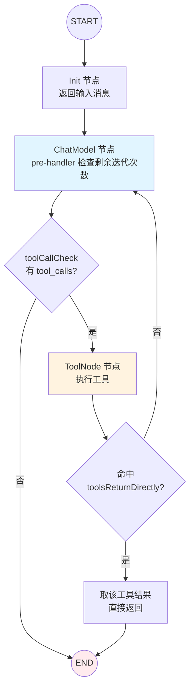

> ADK(Agent Development Kit)是 eino 面向自主智能体的顶层。本文基于 v0.8.12 源码,把 ReAct Agent 拆开,看它如何用一张带循环的 Graph 实现"思考→调工具→再思考",以及迭代上限、工具直接返回、中断三个关键机制怎么落地。

## 背景介绍

ReAct(Reasoning + Acting)是目前最主流的 Agent 范式:LLM 先推理下一步该做什么,如果需要就调用工具,拿到工具结果后再推理,如此循环,直到给出最终答案。

道理简单,工程上却有一堆坑:循环怎么控制不失控?工具结果要不要再喂回模型?流式怎么和工具调用共存?用户想在某一步插手怎么办?eino 把这些都封装进了 `adk` 层。理解它的实现,你就能判断什么时候用现成的、什么时候要自己改。

## 问题分析

一个生产级 ReAct 至少要回答:

1. **循环终止**:模型可能永远想调工具,必须有硬上限。
2. **工具直返(return directly)**:有些工具(比如"提交订单")执行完就该结束,不需要再问模型。
3. **流式**:模型输出要边生成边展示,但又得先判断里面有没有 `tool_call`。
4. **中断/恢复**:人在环路(human-in-the-loop)场景,要能在调某个工具前停下来等人批准。

## 核心原理

### Agent 接口

```go
type Agent interface {
	Name(ctx context.Context) string
	Description(ctx context.Context) string
	Run(ctx context.Context, input *AgentInput, options ...AgentRunOption) *AsyncIterator[*AgentEvent]
}
```

`Run` 不返回最终结果,而是返回一个**事件流** `AsyncIterator[*AgentEvent]`。Agent 每走一步就吐一个事件:

```go
type AgentEvent struct {
	AgentName string
	RunPath   []RunStep       // 走过的路径(多 Agent 时有用)
	Output    *AgentOutput    // 这一步的输出(消息 / 自定义)
	Action    *AgentAction    // 控制流信号
	Err       error
}

type AgentAction struct {
	Exit            bool                   // 退出
	Interrupted     *InterruptInfo         // 被中断
	TransferToAgent *TransferToAgentAction // 转交给别的 Agent
	BreakLoop       *BreakLoopAction       // 跳出循环
	// ...
}
```

这个设计让调用方能实时观测 Agent 的"内心戏"——每一次思考、每一次工具调用都是流里的一个事件。

### ReAct = 一张带循环的 Graph

ReAct 的构造函数 `newReact` 内部建了一张三节点的图:

```
Init(注入输入) → ChatModel(推理) → [分支] → ToolNode(执行工具) → [分支] → ChatModel / END
```

配置结构 `reactConfig` 揭示了所有旋钮:

```go
type reactConfig struct {
	model               model.BaseChatModel
	toolsConfig         *compose.ToolsNodeConfig
	toolsReturnDirectly map[string]bool  // 哪些工具执行完直接返回
	maxIterations       int              // 迭代上限,默认 20
	agentName           string
	// ...
}
```

## 架构设计

ReAct 的图结构与两处分支判定:



两个分支是 ReAct 的灵魂:

- **ChatModel 后的分支** `toolCallCheck`:流式读取模型输出的 chunk,只要发现 `len(chunk.ToolCalls) > 0` 就路由到 ToolNode,否则到 END。
- **ToolNode 后的分支**:如果本轮调用的工具在 `toolsReturnDirectly` 里,走 `toolNodeToEndConverter` 直接返回该工具结果;否则回到 ChatModel 继续下一轮。

## 实现细节

### 迭代控制:防止无限循环

迭代次数存在 Graph 的 State 里。ChatModel 节点的 pre-handler 在每次进入时检查:

```go
// 伪代码,还原 react.go 的核心逻辑
func chatModelPreHandler(ctx context.Context, st *state) error {
	if st.getRemainingIterations() <= 0 {
		return ErrExceedMaxIterations // 超限直接报错终止
	}
	st.decrementRemainingIterations()
	return nil
}
```

`maxIterations` 默认 20。这是硬保险——即使模型陷入"调工具→再调工具"的怪圈,也会在 20 轮后被 `ErrExceedMaxIterations` 打断。生产中要根据任务复杂度调整:简单问答设 5,复杂 Agentic 任务可以放到 30+。

### 工具直返:ReturnDirectlyToolCallID

有些工具执行完不该再回模型。实现方式是在 State 里记一个 `ReturnDirectlyToolCallID`:

```go
// ToolNode 的 pre-handler:如果本次工具命中 toolsReturnDirectly,
// 记下它的 ToolCallID
if cfg.toolsReturnDirectly[toolName] {
	st.setReturnDirectlyToolCallID(toolCallID)
}

// ToolNode 的 post-handler / 分支:检查该 ID,命中则走 converter 直达 END
if ev := st.getReturnDirectlyEvent(); ev != nil {
	return toEndConverter, nil
}
```

典型用途:`submit_order`、`send_email` 这类"终态动作",执行完直接把工具结果作为 Agent 输出,省一次模型调用,既降延迟又省 token。

### 流式与工具调用共存

模型输出是 `MessageStream`(即 `*schema.StreamReader[Message]`)。分支函数 `toolCallCheck` 一边收流一边判断:

```go
func toolCallCheck(ctx context.Context, sMsg *schema.StreamReader[*schema.Message]) (string, error) {
	defer sMsg.Close()
	for {
		chunk, err := sMsg.Recv()
		if err == io.EOF {
			break
		}
		if err != nil {
			return "", err
		}
		if len(chunk.ToolCalls) > 0 {
			return "tools", nil // 只要任一 chunk 带 tool_call 就去执行工具
		}
	}
	return compose.END, nil
}
```

因为是流式判断,一旦在流的早期就检测到 tool_call,可以尽早决策,不必等整条消息生成完。

### 把 Action 附加到工具输出

ReAct 允许工具在执行时,通过 State 给自己的输出事件附加元数据甚至控制信号:

```go
// 在工具实现内部调用,给该工具的输出事件挂一个 AgentAction
func SendToolGenAction(ctx context.Context, toolName string, action *AgentAction) error
```

这是实现"工具触发中断""工具请求转交其他 Agent"等高级行为的底层钩子。

## 示例代码

用 prebuilt 的 ReAct 构造一个带工具的 Agent(这是最常用的入口,不用自己拼图):

```go
import (
	"github.com/cloudwego/eino/adk"
	"github.com/cloudwego/eino/adk/prebuilt/react" // 具体路径以 v0.8.12 为准
	"github.com/cloudwego/eino/components/tool"
)

func newAgent(ctx context.Context, cm model.ToolCallingChatModel,
	weatherTool tool.InvokableTool) (adk.Agent, error) {

	agent, err := react.NewAgent(ctx, &react.Config{
		Model: cm,
		ToolsConfig: compose.ToolsNodeConfig{
			Tools: []tool.BaseTool{weatherTool},
		},
		// 查天气拿到结果就直接返回,不再问模型
		ToolsReturnDirectly: map[string]bool{"get_weather": true},
		MaxIterations:       10,
	})
	return agent, err
}

// 消费 Agent 的事件流
func chat(ctx context.Context, agent adk.Agent, question string) {
	iter := agent.Run(ctx, &adk.AgentInput{
		Messages:        []adk.Message{schema.UserMessage(question)},
		EnableStreaming: true,
	})

	for {
		event, ok := iter.Next()
		if !ok {
			break
		}
		if event.Err != nil {
			log.Printf("agent error: %v", event.Err)
			break
		}
		// 观测每一步:模型思考 / 工具结果
		if out := event.Output; out != nil && out.MessageOutput != nil {
			mv := out.MessageOutput
			if mv.IsStreaming {
				// 流式增量
				for {
					msg, err := mv.MessageStream.Recv()
					if err != nil {
						break
					}
					fmt.Print(msg.Content)
				}
			} else {
				fmt.Println(mv.Message.Content)
			}
		}
		// 观测控制流
		if act := event.Action; act != nil && act.Exit {
			break
		}
	}
}
```

## 性能优化

- **合理设 MaxIterations**:太大浪费 token 且拖慢失败路径,太小会截断复杂任务。按任务类型分档配置。
- **善用 ToolsReturnDirectly**:终态工具设为直返,每次能省一整轮模型往返(通常是延迟大头)。
- **流式消费,别 Collect**:用事件流实时渲染,不要等 Agent 整体跑完再取结果,否则失去 Agent 边想边说的体验。
- **工具本身做并发/超时**:ToolNode 会并发执行同一轮的多个 tool_call,但每个工具内部的网络调用要自己加 `context` 超时,避免一个慢工具拖垮整轮。

## 常见问题

**Q:ReAct 和自己用 Graph 连一个循环有什么区别?**
没有本质区别——ReAct 就是把那张循环图 + 迭代控制 + 直返 + 中断封装好了。自己拼能获得完全控制,但要重新实现这些机制。建议从 prebuilt ReAct 起步,不够用再下沉到 Graph。

**Q:`ErrExceedMaxIterations` 出现时,已经生成的部分还在吗?**
在。事件流里之前的每一步都已经吐出来了,超限只是终止后续循环。你可以捕获这个错误,把已有的中间结果返回给用户。

**Q:怎么让 Agent 在调某个危险工具前停下来等人确认?**
用中断机制。工具或节点通过 `AgentAction.Interrupted` 抛出中断,Agent 状态被保存;之后用 `ResumableAgent.Resume()` 恢复。这是第六篇的主题。

**Q:一轮里模型要求调三个工具,会串行吗?**
不会,ToolNode 会并发执行这三个 tool_call,全部完成后再一起回到模型。

## 总结

ReAct Agent 在 eino 里不是黑盒,而是一张**带循环的 Graph** + 三个关键机制:

- **迭代控制**(`maxIterations` + State 计数)防失控;
- **工具直返**(`ReturnDirectlyToolCallID`)给终态动作抄近路;
- **流式分支**(`toolCallCheck`)让工具判断和流式输出共存。

它和第二篇的 compose 是同构的——Agent 的自主性,本质上是 Graph 的循环 + 分支能力。下一篇我们讲工具:eino 里"像加载 Skills 一样加载工具"到底是怎么回事,以及为什么 eino 没有独立的 Skills 概念。

> 系列导航:(一)总览 → (二)compose → **(三)ADK 与 ReAct** → (四)像加载 Skills 一样加载工具 → (五)MCP 集成 → (六)多智能体对比
