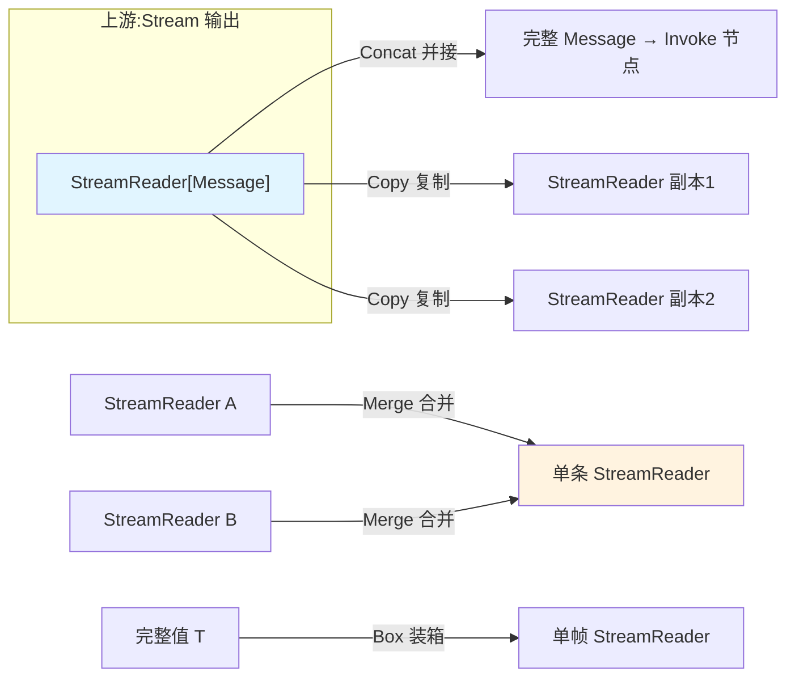
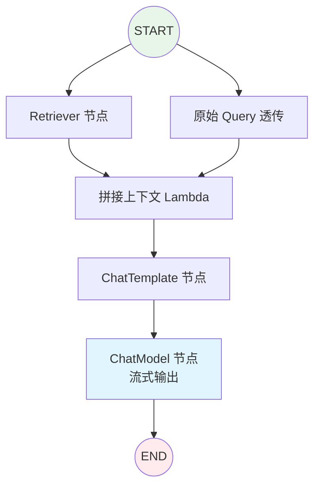

> compose 是 eino 最硬核的一层。它要解决一个看似简单实则棘手的问题:当数据在图的节点之间流动时,有的节点吐流、有的节点吃完整值,框架如何自动缝合?本文基于 v0.8.12 拆解它的类型系统和流处理机制。

## 背景介绍

上一篇讲到,eino 把组件连成有向图来编排。但"连成图"这三个字底下藏着两个魔鬼:

1. **类型对齐**:节点 A 输出 `*schema.Message`,节点 B 只吃 `string`,怎么办?
2. **流的适配**:节点 A 是流式输出(`StreamReader[*Message]`),节点 B 只有非流式的 `Invoke` 实现,框架怎么把流喂给它?

LangChain 里这些问题往往靠"约定 + 运行时报错"糊过去。eino 选择在框架层彻底解决,代价是一套相对复杂但极其自洽的机制。理解了它,你就理解了 eino 为什么敢说自己"流优先"。

## 问题分析

考虑一个 RAG 流程:`Query → Retriever → 拼接上下文 → ChatModel → 输出`。

- `Retriever` 输入 `string`,输出 `[]*schema.Document`。
- "拼接上下文" 输入 `[]*schema.Document`,输出 `map[string]any`(喂给模板)。
- `ChatModel` 输入 `[]*schema.Message`,输出 `*schema.Message`,而且是**流式**的。

这里每一步的输入输出类型都不同,而且最后一步是流。如果让开发者手工处理"上游是流、下游要完整值"的所有组合,代码会爆炸。eino 的答案是:**把节点抽象成四种执行范式,框架自动在它们之间转换。**

## 核心原理

### 四种执行范式

eino 里每个可运行单元(Runnable)理论上有四个方法,对应输入/输出是否为流的四种组合:

| 方法 | 输入 | 输出 |
|------|------|------|
| `Invoke` | 非流 | 非流 |
| `Stream` | 非流 | 流 |
| `Collect` | 流 | 非流 |
| `Transform` | 流 | 流 |

```go
type Runnable[I, O any] interface {
	Invoke(ctx context.Context, input I, opts ...Option) (O, error)
	Stream(ctx context.Context, input I, opts ...Option) (*schema.StreamReader[O], error)
	Collect(ctx context.Context, input *schema.StreamReader[I], opts ...Option) (O, error)
	Transform(ctx context.Context, input *schema.StreamReader[I], opts ...Option) (*schema.StreamReader[O], error)
}
```

关键在于:**你实现组件时,只需提供其中一两个方法,eino 会自动补全另外几个。** 这套自动补全靠的就是下面的"流的四则运算"。

### 流的四则运算:concat / box / merge / copy

当框架需要把一个只实现了 `Invoke`(非流)的节点接到流式链路里时,它需要四种原子操作:

- **Concat(并接)**:把一个 `StreamReader[T]` 的所有帧收集起来,拼成一个完整的 `T`。比如把流式 Message 的每个 chunk 的 `Content` 拼成完整字符串。这样就能喂给只吃完整值的 `Invoke`。
- **Box(装箱)**:反过来,把一个完整的 `T` 包装成只有一帧的 `StreamReader[T]`,喂给需要流的下游。
- **Merge(合并)**:多条入边时,把多个 `StreamReader[T]` 合并成一条。用于 Graph 里一个节点有多个上游。
- **Copy(复制)**:一个流要被多个下游消费时,复制成 N 份独立的 StreamReader(流只能被读一次,必须复制)。



这四个操作组合起来,框架就能在任意"流/非流"节点之间自动缝合。**开发者写组件时完全不用关心下游是不是流**——这是 eino 最优雅的地方。

### 类型对齐

编译时,eino 遍历每条边,检查上游输出类型能否赋值给下游输入类型。泛型让这一步在编译期 + Compile 期双重保障:

```go
// 这行代码在编译期就过不了,因为 Chain 声明了 [string, int]
chain := compose.NewChain[string, int]()
chain.AppendChatModel(model) // ChatModel 输出 *Message,不是 int → 编译/Compile 报错
```

## 架构设计

一个真实 RAG 图的编排结构:



注意 `Retriever` 和 `Query 透传` 都从 `START` 出发,它们没有依赖关系,**eino 会自动并发执行这两个分支**,在 `CTX` 节点处汇合(Merge)。开发者一行 goroutine 都不用写。

## 实现细节

### Chain:线性编排

```go
chain := compose.NewChain[map[string]any, *schema.Message]()
chain.
	AppendChatTemplate(tpl).
	AppendChatModel(model)

r, _ := chain.Compile(ctx)
```

Chain 内部就是一张只有单一路径的 Graph,`Append` 帮你把 `AddNode + AddEdge` 一次做完。

### Graph:带分支与循环

需要条件路由时用 Graph 的 `AddBranch`:

```go
g := compose.NewGraph[map[string]any, *schema.Message]()
_ = g.AddChatModelNode("model", model)
_ = g.AddToolsNode("tools", toolsNode)

// 根据模型输出是否包含 tool_call 决定走向
_ = g.AddBranch("model", compose.NewStreamGraphBranch(
	func(ctx context.Context, sr *schema.StreamReader[*schema.Message]) (string, error) {
		defer sr.Close()
		msg, err := sr.Recv()
		if err != nil {
			return "", err
		}
		if len(msg.ToolCalls) > 0 {
			return "tools", nil // 有工具调用 → 去 tools 节点
		}
		return compose.END, nil // 否则结束
	},
	map[string]bool{"tools": true, compose.END: true},
))
_ = g.AddEdge("tools", "model") // 工具执行完回到 model,形成循环
```

这段代码本质上就是一个 ReAct Agent 的骨架——reason(model)、act(tools)、循环。第三篇会看到 eino 如何把它封装成开箱即用的 ReAct。

注意分支函数拿到的是 `StreamReader`,用的是 `NewStreamGraphBranch`。eino 也提供非流式的 `NewGraphBranch`,框架会自动帮你适配。

### Workflow:字段级映射

Graph 是节点级的数据流。当你需要"把上游输出的某个字段映射到下游输入的某个字段"时,用 Workflow 做字段级编排:

```go
wf := compose.NewWorkflow[Input, Output]()
wf.AddChatModelNode("m", model).
	AddInput(compose.START) // 声明字段级依赖
```

Workflow 适合结构化数据在节点间做精细搬运的场景,避免为了对齐字段而写一堆 Lambda 胶水。

## 示例代码

完整的流式 RAG,展示自动并发与流缝合:

```go
func buildRAG(ctx context.Context, rtr retriever.Retriever,
	tpl prompt.ChatTemplate, model model.BaseChatModel) (
	compose.Runnable[string, *schema.Message], error) {

	g := compose.NewGraph[string, *schema.Message]()

	// 检索节点:string -> []*Document
	_ = g.AddRetrieverNode("retrieve", rtr)

	// 把文档 + 原始 query 组装成模板输入
	_ = g.AddLambdaNode("build_ctx", compose.InvokableLambda(
		func(ctx context.Context, docs []*schema.Document) (map[string]any, error) {
			var sb strings.Builder
			for _, d := range docs {
				sb.WriteString(d.Content + "\n")
			}
			return map[string]any{"context": sb.String()}, nil
		}))

	_ = g.AddChatTemplateNode("prompt", tpl)
	_ = g.AddChatModelNode("model", model)

	_ = g.AddEdge(compose.START, "retrieve")
	_ = g.AddEdge("retrieve", "build_ctx")
	_ = g.AddEdge("build_ctx", "prompt")
	_ = g.AddEdge("prompt", "model")
	_ = g.AddEdge("model", compose.END)

	return g.Compile(ctx)
}

// 调用:model 节点流式产出,Stream 一路透传到最外层
func run(ctx context.Context, r compose.Runnable[string, *schema.Message]) {
	stream, _ := r.Stream(ctx, "什么是向量数据库?")
	defer stream.Close()
	for {
		msg, err := stream.Recv()
		if err != nil {
			break
		}
		fmt.Print(msg.Content)
	}
}
```

即使中间的 `build_ctx`、`prompt` 都是非流节点,最后的 `model` 是流节点,外层 `Stream` 依然能拿到完整的流——因为框架用 concat/box 自动缝合了它们。

## 性能优化

- **让能并行的节点没有边相连**:eino 靠边推断依赖,没有依赖的节点自动并发。刻意把独立的检索、多路召回拆成平行分支,能显著降延迟。
- **警惕隐式 Concat**:非流节点接在流后面,框架会 Concat 整条流,这会**吃掉流式的首字节优势**。如果追求首 token 延迟,尽量让热路径全流式。
- **Copy 有成本**:一个流被 N 个下游消费会复制 N 份,每份都要缓冲。扇出很大时注意内存。
- **Compile 结果缓存**:编译后的 Runnable 是并发安全且可复用的,放到全局或 sync.Once 里,别每次请求都编译。

## 常见问题

**Q:我实现组件时到底要实现哪几个方法?**
最少实现一个。若你只有同步逻辑,实现 `Invoke`(用 `InvokableLambda`);只有流式逻辑,实现 `Stream`。其余三种范式由框架自动生成。

**Q:为什么我的流式应用首字节很慢?**
大概率热路径里有非流节点触发了 Concat,框架必须等上游流全部收完拼成完整值才继续。检查链路,把关键路径改成 `Transform` 语义的流式节点。

**Q:分支函数里的 StreamReader 一定要 Close 吗?**
要。分支函数通常只 Recv 第一帧就够判断路由了,剩下的必须 `Close()` 释放,否则 goroutine 泄漏。示例里的 `defer sr.Close()` 不能省。

**Q:Graph 支持循环,会不会死循环?**
会。所以 Agent 场景必须自己加迭代上限(见第三篇的 `maxIterations`),Graph 本身不阻止你连成环。

## 总结

compose 层的精髓是**用四种执行范式(Invoke/Stream/Collect/Transform)+ 四则流运算(concat/box/merge/copy)彻底屏蔽流与非流的差异**。开发者只管写业务逻辑,不用关心上下游是不是流;框架在编译期对齐类型、运行期自动缝合、并自动并发无依赖节点。

这套机制是 eino 区别于其他框架的核心竞争力。下一篇进入 `adk` 层,看 eino 如何把 Graph 的循环能力,封装成一个真正会"思考-行动"的 ReAct Agent。

> 系列导航:(一)总览 → **(二)compose 编排引擎** → (三)ADK 与 ReAct → (四)像加载 Skills 一样加载工具 → (五)MCP 集成 → (六)多智能体对比
