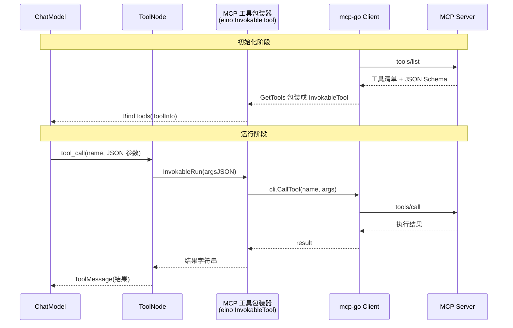
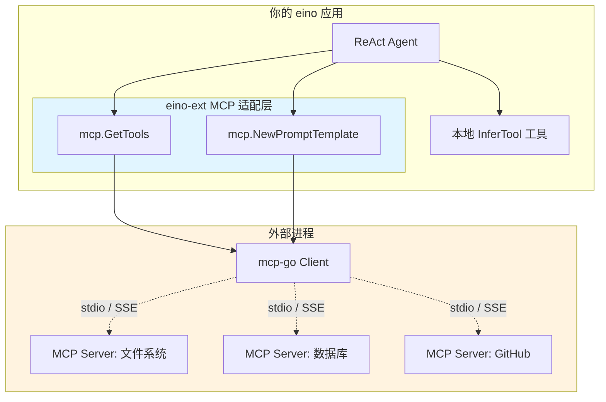

> MCP(Model Context Protocol)是 Anthropic 提出的、让 LLM 应用与外部工具/数据源解耦的开放协议。本文讲清楚 eino 如何接入 MCP:它不在 core 仓库,而在 eino-ext;它做的事,是把 MCP server 暴露的工具和 Prompt "翻译"成 eino 的原生组件。

## 背景介绍

上一篇结尾留了个悬念:如果想要"从外部动态发现、即插即用"的工具体验,eino 的答案是 MCP。

MCP 的价值在于**解耦**:工具的实现(文件系统、数据库、GitHub、浏览器……)跑在独立的 MCP server 里,你的 Agent 作为 MCP client 在运行时连上去、列出工具、按需调用。工具的增删改不需要重新编译你的 Agent。这正是"Skills 生态"最想要的形态。

**关键事实:eino v0.8.12 的 core 仓库里没有任何 MCP 代码。** MCP 集成位于独立的 **eino-ext** 仓库,分两个包:

- `components/tool/mcp` —— 把 MCP 工具适配成 eino 的 `InvokableTool`
- `components/prompt/mcp` —— 把 MCP Prompt 适配成 eino 的 `ChatTemplate`

底层封装的是社区的 `github.com/mark3labs/mcp-go` 客户端。

## 问题分析

要把 MCP 接进 eino,适配层必须回答:

1. **协议翻译**:MCP 的 `tools/list`、`tools/call` 如何映射到 eino 的 `Info` / `InvokableRun`?
2. **Schema 透传**:MCP 工具自带 JSON Schema,如何原样变成 eino 的 `ToolInfo`?
3. **透明性**:接进来的 MCP 工具,在 ChatModel 和 ReAct 眼里,能不能和原生工具一模一样?

第三点是设计目标:**从模型视角,MCP 工具与原生 eino 工具不可区分**。这样上层(ReAct、Graph)完全不用为 MCP 写特殊逻辑。

## 核心原理

### GetTools:一次调用完成适配

`mcp` 包的核心 API 极简:

```go
import "github.com/cloudwego/eino-ext/components/tool/mcp"

tools, err := mcp.GetTools(ctx, &mcp.Config{
	Cli: cli, // 一个 mark3labs/mcp-go 的 client
})
```

`GetTools` 内部做三件事:

1. 调 `cli.ListTools()` 从 server 拉取工具清单(每个含 name、description、inputSchema)。
2. 把每个 MCP 工具包装成一个 eino `InvokableTool`:
   - `Info()` 直接返回 MCP 工具的 name/description/schema 转换成的 `ToolInfo`。
   - `InvokableRun(argsJSON)` 内部调 `cli.CallTool(name, args)`,把结果转成字符串返回。
3. 支持一个 **name 过滤器**,可以只包含或排除特定工具(避免把 server 上全部工具都塞给模型)。

一句话:**MCP server 上的每个工具 = 一个 eino InvokableTool**。适配是 1:1 的。

### 调用闭环



对 ReAct 来说,右边的 MCP server 是完全透明的——它只知道自己在调一个 `InvokableTool`。

### MCP Prompt → ChatTemplate

MCP 不只有工具,还能提供 Prompt 模板。`prompt/mcp` 包把它适配成 eino 的 `ChatTemplate`:

```go
import "github.com/cloudwego/eino-ext/components/prompt/mcp"

tpl, err := mcp.NewPromptTemplate(ctx, &mcp.Config{
	Cli:  cli,
	Name: "code_review", // MCP server 上某个 prompt 的名字
})
```

之后 `tpl` 就能像任何 eino ChatTemplate 一样,放进 Chain / Graph 里 `Format` 出消息。

## 架构设计

MCP 在整个 eino 应用中的位置:



本地工具和 MCP 工具可以**混用**——它们最终都是 `tool.BaseTool`,一起塞进 ReAct 的 `ToolsConfig` 即可。

## 实现细节

### 完整接入示例

```go
import (
	"context"

	"github.com/cloudwego/eino/adk"
	"github.com/cloudwego/eino/components/tool"
	"github.com/cloudwego/eino/compose"
	"github.com/cloudwego/eino-ext/components/tool/mcp"

	mcpclient "github.com/mark3labs/mcp-go/client"
)

func buildAgentWithMCP(ctx context.Context, cm model.ToolCallingChatModel) (adk.Agent, error) {
	// 1. 起一个 MCP client,连到本地文件系统 MCP server(stdio 方式)
	cli, err := mcpclient.NewStdioMCPClient(
		"npx", nil,
		"-y", "@modelcontextprotocol/server-filesystem", "/data",
	)
	if err != nil {
		return nil, err
	}
	// MCP 协议要求先 initialize
	if _, err = cli.Initialize(ctx, /* initialize 请求 */); err != nil {
		return nil, err
	}

	// 2. 把 MCP 工具适配成 eino 工具,并只保留需要的两个
	mcpTools, err := mcp.GetTools(ctx, &mcp.Config{
		Cli:          cli,
		ToolNameList: []string{"read_file", "list_directory"}, // 白名单过滤
	})
	if err != nil {
		return nil, err
	}

	// 3. 本地工具 + MCP 工具混用
	localTool, _ := utils.InferTool("get_weather", "查询天气", getWeather)
	allTools := append([]tool.BaseTool{localTool}, mcpTools...)

	// 4. 交给 ReAct,MCP 工具对它完全透明
	return react.NewAgent(ctx, &react.Config{
		Model:         cm,
		ToolsConfig:   compose.ToolsNodeConfig{Tools: allTools},
		MaxIterations: 10,
	})
}
```

### stdio vs SSE

`mcp-go` 支持两种传输:

- **stdio**:client 直接以子进程方式拉起 server,通过标准输入输出通信。适合本地工具(文件系统、shell 等)。
- **SSE / HTTP**:连接远程 MCP server。适合团队共享的、跑在别处的工具服务。

选哪种取决于工具部署形态,对 eino 适配层无影响——`GetTools` 只认 `Cli` 接口。

### 生命周期管理

MCP client 持有子进程或长连接,**必须管好生命周期**:应用启动时 `Initialize`,退出时 `Close`。别在每次请求里新建 client——`ListTools` 有网络开销,且频繁拉起子进程代价高。正确做法是启动时建好 client、`GetTools` 一次,把结果复用到编译好的 Agent 里。

## 性能优化

- **工具清单启动时拉取,别放请求路径**:`GetTools`(内含 `ListTools`)是初始化操作,只做一次。运行期只走 `CallTool`。
- **用白名单收窄工具集**:`ToolNameList` 过滤掉用不到的工具,既降低模型选择难度,也减少 prompt 体积。一个文件系统 server 可能暴露十几个工具,你可能只要两个。
- **给 CallTool 设超时**:MCP 调用跨进程/跨网络,务必用 `ctx` 控超时,防止一个卡住的 server 拖垮整个 Agent 轮次。
- **复用 client 连接**:SSE 模式下连接复用,避免每次调用重连的握手开销。

## 常见问题

**Q:为什么我在 core 仓库找不到 MCP 代码?**
因为它不在 core。core 保持轻量,MCP 属于可选集成,放在 eino-ext 的 `components/tool/mcp` 和 `components/prompt/mcp`。

**Q:MCP 工具和本地工具能混用吗?**
能,而且这是推荐姿势。两者都是 `tool.BaseTool`,一起放进 `ToolsConfig` 即可。模型不区分它们的来源。

**Q:MCP 工具支持流式返回吗?**
适配层把 MCP 工具包装成 `InvokableTool`(同步)。MCP 的 `tools/call` 本身是请求-响应式,所以以同步语义接入最自然。

**Q:MCP 相比直接写本地工具,代价是什么?**
多了一层进程/网络边界,延迟更高、要管 client 生命周期和错误处理。换来的是解耦和复用——工具能被多个应用共享、独立升级。规模小、工具固定时,本地 `InferTool` 更省事;需要生态复用、动态发现时,MCP 更合适。

**Q:eino 能自己做 MCP server 吗?**
本文讲的是 eino 作为 MCP **client** 消费外部工具。反向暴露(eino 应用作为 server)不在 v0.8.12 这两个适配包的范畴,需要另行用 mcp-go 的 server 端能力实现。

## 总结

eino 接入 MCP 的思路干净利落:**在 eino-ext 里放一个 1:1 适配层,把 MCP 的每个工具翻译成 `InvokableTool`、每个 Prompt 翻译成 `ChatTemplate`**,使得 MCP 对上层的 ReAct / Graph 完全透明。本地工具与 MCP 工具可以自由混用。

到这里,单个 Agent 的能力构建(编排、ReAct、工具、MCP)已经讲完。最后一篇进入多智能体:当一个 Agent 搞不定时,eino 的 Supervisor、Plan-Execute、DeepAgent 各自适合什么场景、优劣如何。

> 系列导航:(一)总览 → (二)compose → (三)ADK 与 ReAct → (四)加载工具 → **(五)MCP 集成** → (六)多智能体对比
