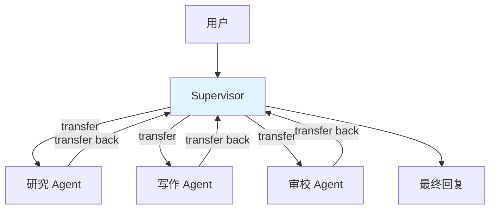
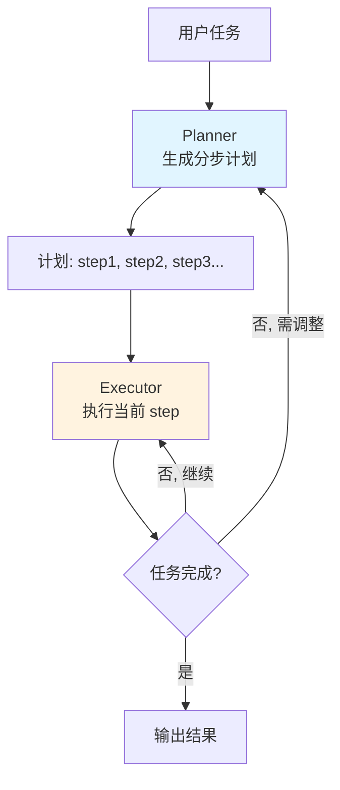
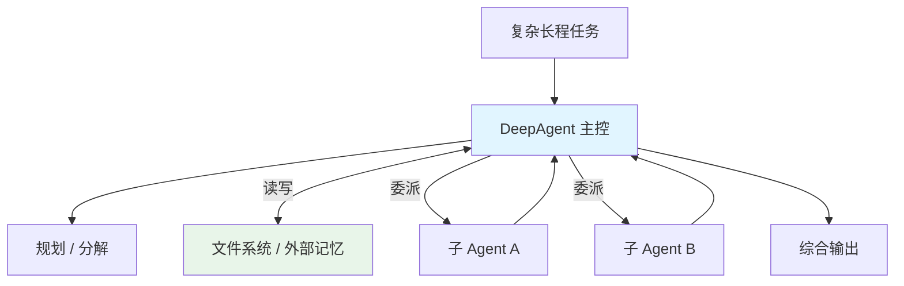
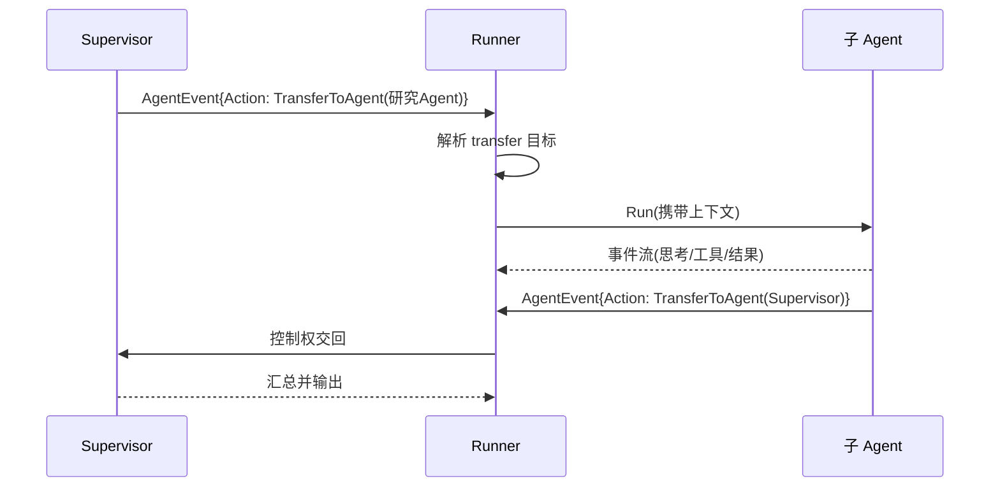

> 单个 ReAct Agent 面对复杂任务会力不从心:上下文爆炸、职责混乱、难以规划。eino 在 `adk/prebuilt` 里给了三种多智能体范式——Supervisor、Plan-Execute、Deep。本文基于 v0.8.12 拆解它们的机制、优劣与选型,并讲清底层的 transfer 与中断/恢复。

## 背景介绍

当任务变复杂,单 Agent 有三个天花板:

1. **上下文膨胀**:所有工具、所有历史挤在一个 prompt 里,模型注意力被稀释。
2. **职责混乱**:一个 Agent 既要规划又要执行还要总结,容易顾此失彼。
3. **缺乏显式规划**:ReAct 是走一步看一步,没有全局计划,复杂任务容易跑偏。

多智能体(multi-agent)的思路是**分而治之**:把大任务拆给若干各司其职的子 Agent,由某种协作结构组织它们。eino 的 `adk/prebuilt` 目录提供了三种现成结构:`supervisor`、`planexecute`、`deep`。

## 问题分析

多智能体绕不开两个底层问题:

1. **控制权如何交接?** —— 一个 Agent 怎么把任务转给另一个?靠什么信号?
2. **状态如何流转?** —— 子 Agent 的产出怎么回到主流程?

eino 用第三篇提到的 `AgentAction` 统一解决:

```go
type AgentAction struct {
	TransferToAgent *TransferToAgentAction // 转交控制权给指定 Agent
	Exit            bool                   // 结束
	BreakLoop       *BreakLoopAction       // 跳出循环
	// ...
}
```

多 Agent 之间通过 `OnSubAgents` 接口建立父子关系:

```go
type OnSubAgents interface {
	OnSetSubAgents(ctx context.Context, agents []Agent) error
	OnSetAsSubAgent(ctx context.Context, parent Agent) error
	OnDisallowTransferToParent(ctx context.Context) error
}
```

三种范式的差别,本质是**用不同拓扑组织 transfer 的流向**。

## 核心原理:三种范式

### 1. Supervisor(主管-下属)

一个 Supervisor Agent 统领多个专职子 Agent。Supervisor 负责理解用户意图、把任务路由给合适的子 Agent、汇总结果。子 Agent 干完活把控制权 transfer 回 Supervisor。



**特点**:星型拓扑,Supervisor 是唯一的调度中枢。像一个项目经理带一队专家。

### 2. Plan-Execute(先规划后执行)

先由一个 Planner 生成完整的分步计划,再由 Executor 逐步执行,必要时回到 Planner 重新规划(replan)。它把"规划"和"执行"显式分离,解决了 ReAct "走一步看一步、没有全局观"的问题。



**特点**:线性拓扑 + replan 回路。适合步骤明确、需要全局规划的任务(如"调研并写一份报告")。

### 3. DeepAgent(深度智能体)

`deep` 是为长程、复杂、需要持久化中间状态的任务设计的。它通常整合了:子 Agent 委派、外部记忆/文件系统(`adk/filesystem`)、更强的规划与回溯能力。相当于把 Supervisor 的委派 + Plan-Execute 的规划 + 持久状态揉在一起,处理"需要几十步、要记笔记"的深度任务。



**特点**:带外部记忆,能把中间结果写到文件系统再回读,突破单次上下文窗口限制。适合最复杂的 Agentic 任务。

## 架构设计:transfer 如何工作

不管哪种范式,控制权交接都走同一条底层机制:



Runner 是调度器,它读取每个 `AgentEvent` 的 `Action`,遇到 `TransferToAgent` 就切换当前活跃 Agent。`deterministic_transfer.go` 还支持确定性(非 LLM 决策)的转交,用于流程固定的场景。

## 实现细节

### 构造一个 Supervisor(示意)

```go
import "github.com/cloudwego/eino/adk/prebuilt/supervisor"

// 先各自造好专职子 Agent(都是 ReAct)
researchAgent, _ := react.NewAgent(ctx, &react.Config{Model: cm, ToolsConfig: researchTools})
writeAgent, _   := react.NewAgent(ctx, &react.Config{Model: cm})

// 用 Supervisor 把它们组织起来
sup, err := supervisor.New(ctx, &supervisor.Config{
	Model: cm, // Supervisor 自己的决策模型
	SubAgents: []adk.Agent{researchAgent, writeAgent},
	// Supervisor 的系统指令:描述每个子 Agent 的职责,让它学会路由
})
```

Supervisor 的系统 prompt 里会带上每个子 Agent 的 `Name` 和 `Description`——这正是子 Agent `Description(ctx)` 方法的用途:让 Supervisor 知道"什么任务该找谁"。

### 中断与恢复:人在环路

多 Agent 长任务里,人常需要在关键步骤介入。eino 用 `ResumableAgent` 支持中断-恢复:

```go
type ResumableAgent interface {
	Agent
	Resume(ctx context.Context, info *ResumeInfo, opts ...AgentRunOption) *AsyncIterator[*AgentEvent]
}
```

当某步抛出 `AgentAction.Interrupted`,Runner 保存当前状态并结束本次运行;人工审批后,调 `Resume` 从断点继续。这依赖 compose 层的 checkpoint 能力把图的 State 持久化下来。

```go
iter := agent.Run(ctx, input)
for {
	ev, ok := iter.Next()
	if !ok { break }
	if ev.Action != nil && ev.Action.Interrupted != nil {
		// 保存 ev.Action.Interrupted 里的断点信息,等人工决策
		saveCheckpoint(ev.Action.Interrupted)
		return
	}
}
// ... 人工批准后 ...
resumeIter := agent.(adk.ResumableAgent).Resume(ctx, resumeInfo)
```

## 示例代码:选型决策的伪代码

用一段"任务路由"逻辑说明三者的适用边界:

```go
func pickAgentPattern(task Task) string {
	switch {
	case task.NeedsSpecializedRoles && !task.NeedsGlobalPlan:
		// 多个明确分工、由中枢调度 → Supervisor
		return "supervisor"
	case task.HasClearSteps && task.NeedsGlobalPlan:
		// 步骤明确、需要先规划再执行 → Plan-Execute
		return "plan-execute"
	case task.IsLongHorizon && task.NeedsPersistentMemory:
		// 长程、要记笔记、可能几十步 → DeepAgent
		return "deep"
	default:
		// 简单任务,单 ReAct 足矣,别过度设计
		return "single-react"
	}
}
```

## 性能优化

- **不要为了多智能体而多智能体**:每多一个 Agent 就多一轮甚至多次模型调用。简单任务用单 ReAct,延迟和成本都更低。
- **子 Agent 的 Description 要精准**:Supervisor 的路由准确率完全取决于子 Agent 描述质量。描述含糊 = 频繁路由错误 = 大量无效往返。
- **给每个子 Agent 收窄工具集**:分而治之的核心红利就是每个 Agent 只带自己需要的工具,prompt 更短、选择更准。别让子 Agent 都绑定全量工具,那就失去了拆分的意义。
- **DeepAgent 善用文件系统卸载上下文**:把中间产物写文件、需要时再读,是突破上下文窗口、控制 token 成本的关键。
- **中断点不要太密**:每个中断都要持久化 State,过于频繁的人工介入会拖垮吞吐。只在真正高风险的动作上设断点。

## 常见问题

**Q:Supervisor 和 Plan-Execute 最大的区别?**
Supervisor 是**动态路由**——走一步看情况再决定下一个找谁;Plan-Execute 是**先定计划**——一次性把步骤规划好再逐步执行。前者灵活应对开放任务,后者适合步骤可预先规划的任务。

**Q:DeepAgent 是不是永远最强,直接都用它?**
不是。DeepAgent 机制最重、调用最多、最慢最贵。只有真正长程、需要持久记忆的任务才值得。杀鸡别用牛刀。

**Q:子 Agent 之间能直接互相 transfer 吗,还是必须经过 Supervisor?**
取决于拓扑配置。默认 Supervisor 模式是星型(子 Agent 转回 Supervisor)。通过 `OnDisallowTransferToParent` 等接口可以调整交接规则,构造更自由的网状协作,但复杂度也随之上升。

**Q:多 Agent 出错怎么定位?**
靠 `AgentEvent.RunPath`——它记录了事件流经的 Agent 路径。结合第一篇提到的 callbacks(下节延伸),能完整还原"哪个 Agent 在哪一步出的错"。

**Q:中断恢复对模型有额外要求吗?**
没有对模型的特殊要求,但要求你的存储层能可靠持久化 checkpoint(State + 断点信息)。生产中通常落到 Redis / DB。

## 总结

eino 的多智能体三剑客,本质是用不同拓扑组织 `TransferToAgent` 的流向:

- **Supervisor**:星型动态路由,项目经理带专家团,适合职责清晰的开放任务;
- **Plan-Execute**:先规划后执行 + replan,适合步骤明确、需要全局观的任务;
- **DeepAgent**:委派 + 规划 + 持久记忆,适合最复杂的长程任务。

选型的第一原则是**克制**:能用单 ReAct 解决就别上多 Agent。真需要时,按"是否需要专职分工 / 全局规划 / 持久记忆"三个维度对号入座。

至此,eino 系列六篇完结——从三层架构、compose 编排、ReAct、工具与 MCP,到多智能体。希望这套拆解能帮你在 Go 生态里,把 LLM 应用做得既灵活又可控。

> 系列导航:(一)总览 → (二)compose → (三)ADK 与 ReAct → (四)加载工具 → (五)MCP 集成 → **(六)多智能体对比**(完)
