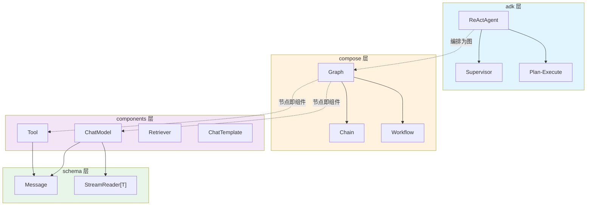

> eino 是字节跳动 CloudWeGo 开源的 Go 语言 LLM 应用开发框架。本文基于 v0.8.12 源码,拆解它的三层架构、类型系统与"流优先"设计,搞清楚它和 LangChain 到底有什么不同。

## 背景介绍

在 Python 生态里,LangChain / LlamaIndex 几乎垄断了 LLM 应用开发。但当你要把一个 Agent 服务部署到高并发的生产环境,Python 的 GIL、动态类型带来的运行时错误、以及一言难尽的流式处理,都会变成运维噩梦。

eino(发音同 "I know")是 CloudWeGo 给出的 Go 答案。它不是简单地把 LangChain 翻译成 Go,而是重新思考了几个问题:

- 类型能不能在**编译期**对齐,而不是运行时才报 `KeyError`?
- 流式(streaming)能不能是框架的**默认能力**,而不是打补丁?
- 编排(orchestration)能不能既灵活又可静态校验?

要理解 eino,得先理解它的分层。它把整个框架切成三层,每层解决一类问题。

## 问题分析

先看一个典型的 LLM 应用要处理哪些事:

1. **调用组件**:调 ChatModel、查向量库(Retriever)、渲染 Prompt 模板、执行 Tool。
2. **编排流程**:把上面这些组件按业务逻辑串起来——可能是线性的 Chain,也可能是带分支、循环的 Graph。
3. **自主决策**:让 LLM 自己决定下一步调哪个工具,即 Agent。

大多数框架把这三件事糅在一起,导致抽象泄漏:你想换个 ChatModel 实现,却发现编排逻辑里到处是某个具体模型的假设。eino 的做法是**严格分层**,每层只依赖下一层的接口:

```
┌─────────────────────────────────────┐
│  adk (Agent Development Kit)         │  自主决策:ReAct / Supervisor ...
├─────────────────────────────────────┤
│  compose (Graph / Chain 编排)        │  确定性流程:类型对齐 + 流处理
├─────────────────────────────────────┤
│  components (ChatModel/Tool/...)     │  组件抽象:可插拔的接口
└─────────────────────────────────────┘
         schema (Message / StreamReader)   贯穿所有层的数据类型
```

## 核心原理

### 1. components:一切皆接口

`components` 层定义了一组最小接口。以 ChatModel 为例:

```go
// components/model
type BaseChatModel interface {
	Generate(ctx context.Context, input []*schema.Message, opts ...Option) (*schema.Message, error)
	Stream(ctx context.Context, input []*schema.Message, opts ...Option) (
		*schema.StreamReader[*schema.Message], error)
}

// 支持工具绑定的 ChatModel
type ToolCallingChatModel interface {
	BaseChatModel
	WithTools(tools []*schema.ToolInfo) (ToolCallingChatModel, error)
}
```

注意两点:

- `Generate` 和 `Stream` 是**并列**的,streaming 不是附加功能。
- `WithTools` 返回一个**新的** ChatModel,而不是原地修改——这是 eino 里反复出现的不可变(immutable)风格。

具体实现(OpenAI、Claude、Ollama 等)全部在独立的 **eino-ext** 仓库,core 仓库只有接口。这让 core 保持极小、依赖干净。

### 2. schema:Message 与 StreamReader

`schema` 层是贯穿所有层的数据类型。最核心的是 `Message` 和 `StreamReader`:

```go
type Message struct {
	Role       schema.RoleType  // system / user / assistant / tool
	Content    string
	ToolCalls  []schema.ToolCall
	ToolCallID string
	// ...
}

// StreamReader 是一个泛型流,贯穿整个框架
type StreamReader[T any] struct { /* ... */ }

func (sr *StreamReader[T]) Recv() (T, error)  // io.EOF 表示流结束
func (sr *StreamReader[T]) Close()
```

`StreamReader[T]` 是 eino 的灵魂。它像 Go channel,但带了背压、复制(copy)、合并(merge)等语义。后面第二篇会专门讲。

### 3. compose:把组件连成图

`compose` 层把组件连接成有向图,并在**编译期**校验类型。核心概念是 Graph 和它的语法糖 Chain:

```go
chain := compose.NewChain[map[string]any, *schema.Message]()
chain.AppendChatTemplate(tpl).
	AppendChatModel(model)

runnable, err := chain.Compile(ctx)  // 编译期检查上下游类型是否对齐
out, err := runnable.Invoke(ctx, map[string]any{"query": "你好"})
```

如果 `tpl` 的输出类型和 `model` 的输入类型对不上,`Compile` 会直接返回错误,而不是等到线上跑起来才 panic。这是 Go 静态类型带给 eino 的最大红利。

### 4. adk:让 LLM 自己决策

最上层 `adk` 提供 Agent 抽象。Agent 接口非常克制:

```go
type Agent interface {
	Name(ctx context.Context) string
	Description(ctx context.Context) string
	Run(ctx context.Context, input *AgentInput, options ...AgentRunOption) *AsyncIterator[*AgentEvent]
}
```

`Run` 返回一个 `AsyncIterator[*AgentEvent]`——又是流。Agent 的每一步(思考、调工具、转交给别的 Agent)都作为一个 `AgentEvent` 事件流出来,天然支持边跑边展示。

## 架构设计

把四层的调用关系画出来:



关键设计约束:**上层可以用下层,下层不知道上层存在**。一个 Agent 本质上会被编译成一张 Graph,Graph 的节点就是各种 component。这种同构让整个框架的心智模型高度统一——你学会了 Graph,就理解了 Agent 的运行机制。

## 实现细节

### 组件如何变成图节点

compose 允许任何满足特定函数签名的东西成为节点。比如一个自定义 Lambda 节点:

```go
// 把普通函数包装成图节点
lambda := compose.InvokableLambda(func(ctx context.Context, in string) (string, error) {
	return strings.ToUpper(in), nil
})

g := compose.NewGraph[string, string]()
_ = g.AddLambdaNode("upper", lambda)
_ = g.AddEdge(compose.START, "upper")
_ = g.AddEdge("upper", compose.END)
```

`START` 和 `END` 是两个虚拟节点,标记图的入口和出口。`AddEdge` 建立数据流向。编译时,eino 做一次拓扑排序 + 类型对齐检查。

### 不可变与 Option 模式

eino 大量使用函数式 Option。以调用时覆盖模型温度为例:

```go
out, err := runnable.Invoke(ctx, input,
	compose.WithChatModelOption(model.WithTemperature(0.2)),
	compose.WithCallbacks(myTracer),
)
```

Option 在**运行时**注入,不改变编译后的图结构。这让同一张编译好的图能被并发复用,不同请求带不同参数——对高 QPS 服务至关重要。

## 示例代码

一个最小但完整的"模板 → 模型"应用,展示四层如何协作:

```go
package main

import (
	"context"
	"fmt"

	"github.com/cloudwego/eino/components/prompt"
	"github.com/cloudwego/eino/compose"
	"github.com/cloudwego/eino/schema"
	// ChatModel 实现来自 eino-ext
	"github.com/cloudwego/eino-ext/components/model/openai"
)

func main() {
	ctx := context.Background()

	// 1. components 层:构造模板与模型
	tpl := prompt.FromMessages(schema.FString,
		schema.SystemMessage("你是一个{role}"),
		schema.UserMessage("{query}"),
	)
	model, _ := openai.NewChatModel(ctx, &openai.ChatModelConfig{
		Model: "gpt-4o",
	})

	// 2. compose 层:编排为 Chain
	chain := compose.NewChain[map[string]any, *schema.Message]()
	chain.AppendChatTemplate(tpl).AppendChatModel(model)

	runnable, err := chain.Compile(ctx)
	if err != nil {
		panic(err) // 类型不对齐会在这里暴露
	}

	// 3. 流式执行
	stream, _ := runnable.Stream(ctx, map[string]any{
		"role":  "资深 Go 工程师",
		"query": "解释一下 GMP 调度模型",
	})
	defer stream.Close()

	for {
		msg, err := stream.Recv()
		if err != nil {
			break // io.EOF
		}
		fmt.Print(msg.Content)
	}
}
```

同一个 `runnable`,你既可以 `Invoke`(要完整结果)也可以 `Stream`(要流),框架自动帮你处理两种模式之间的转换——这是下一篇的重点。

## 性能优化

- **图编译一次,复用多次**:`Compile` 是相对昂贵的操作(拓扑排序、类型检查、构建执行计划)。务必在服务启动时编译好,请求路径上只调 `Invoke`/`Stream`。
- **StreamReader 及时 Close**:流底层持有 goroutine 和 channel,忘记 `Close()` 会泄漏。用 `defer stream.Close()` 兜底。
- **组件级并发**:Graph 中没有依赖关系的节点会被 eino 自动并发执行,不需要你手写 goroutine。把能并行的检索、工具调用拆成独立节点即可白嫖并发。
- **减少流/非流转换**:如果全链路都是流,中间不要插入强制 concat 成完整值的节点,否则会破坏流式的低延迟特性。

## 常见问题

**Q:eino 和 LangChain 最本质的区别是什么?**
类型系统。LangChain 的组件间靠 `dict` 传递,字段错了要到运行时才发现;eino 靠 Go 泛型 + 编译期检查,`Compile` 阶段就拦住大部分错误。

**Q:为什么组件实现都在 eino-ext 而不在主仓库?**
为了让 core 保持轻量、依赖干净。你不会因为用了 Claude 就被迫拉进 OpenAI SDK 的依赖。core 只定义接口,实现按需引入。

**Q:没有 Python 那么多现成组件,怎么办?**
eino-ext 已覆盖主流模型(OpenAI、Claude、Gemini、Ollama、豆包等)、向量库、Reranker 等。缺的部分,用 `InvokableLambda` 几行就能包一个自定义组件进图。

**Q:Graph 和 Chain 该用哪个?**
Chain 是 Graph 的线性语法糖,适合无分支流程。需要条件分支、循环(比如 Agent 的 reason-act 循环)就用 Graph。

## 总结

eino 的设计哲学可以浓缩成三句话:

1. **分层解耦**:components 定义能力,compose 负责编排,adk 负责决策,schema 贯穿始终。
2. **类型优先**:把能在编译期解决的错误,绝不留到运行时。
3. **流是一等公民**:`StreamReader[T]` 贯穿全栈,而不是事后补的功能。

理解了这三层,后面的一切都是它的展开。下一篇我们深入 `compose` 引擎,看看 eino 是如何把"流的并接、装箱、合并、复制"做成框架底座的——这是 eino 最硬核、也最容易被低估的部分。

> 系列导航:**(一)总览与设计哲学** → (二)compose 编排引擎 → (三)ADK 与 ReAct → (四)像加载 Skills 一样加载工具 → (五)MCP 集成 → (六)多智能体对比
