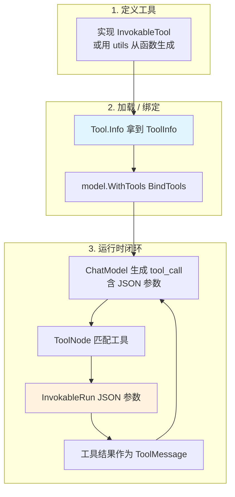
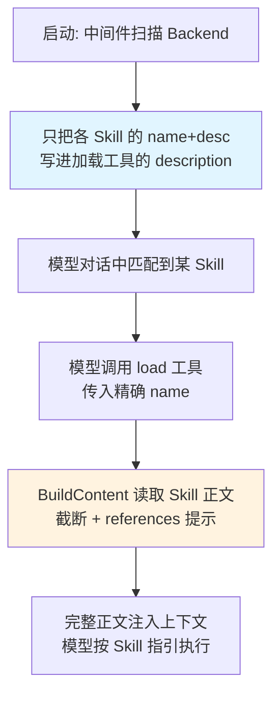

> 很多人从 Claude Code / OpenAI 那边带着"Skills"的心智来找 eino,想知道"怎么加载 skills"。先说结论:**eino v0.8.12 的核心 `components/tool` 里没有 Skills 这个抽象,它的等价物是 Tool;但 adk 层的 `adk/middlewares/skill` 包确实提供了一个和 Claude Skills 高度对应的 Skill 抽象**(SKILL.md + frontmatter + 渐进式披露)。本文讲清楚 eino 的工具体系——如何定义、加载、绑定,以及它和"Skills"心智的对应关系。

## 背景介绍

"Skills"是一个产品化的概念:一份描述 + 一段能力,Agent 按需加载。不同框架叫法不同——Claude 叫 Skills,OpenAI 叫 Function / Tools,LangChain 叫 Tools。它们底层其实是同一件事:**给 LLM 一组它可以调用的外部能力,并让模型自己决定何时调、传什么参数。**

eino 核心选择了最朴素也最通用的命名:Tool。如果你脑子里装的是"加载一个 skill",在 eino 核心里就翻译成"注册一个 Tool 并 BindTools 到模型"。而在 adk 层,`adk/middlewares/skill` 又在 Tool 之上封了一个真正叫 Skill 的更高抽象。本文就把这两层映射讲透。

## 问题分析

要把一个外部能力接进 LLM,框架必须解决三件事:

1. **描述(Schema)**:告诉模型这个能力叫什么、干什么、需要哪些参数——即 JSON Schema。模型靠它做意图识别。
2. **执行(Invoke)**:模型决定调用后,框架用模型给出的 JSON 参数真正执行,并把结果喂回去。
3. **加载(Bind)**:把一批工具的描述绑定到 ChatModel,让模型"知道"自己有哪些牌可打。

## 核心原理

### 三个 Tool 接口

eino 的工具抽象在 `components/tool`,有三个核心接口,层层递进(v0.8.12 另有 `EnhancedInvokableTool` / `EnhancedStreamableTool` 两个多模态增强变体,返回结构化结果,这里先聚焦核心三接口):

```go
// 最基础:提供工具的元信息(名字、描述、参数 schema)
type BaseTool interface {
	Info(ctx context.Context) (*schema.ToolInfo, error)
}

// 可同步调用的工具
type InvokableTool interface {
	BaseTool
	InvokableRun(ctx context.Context, argumentsInJSON string, opts ...Option) (string, error)
}

// 可流式返回的工具
type StreamableTool interface {
	BaseTool
	StreamableRun(ctx context.Context, argumentsInJSON string, opts ...Option) (*schema.StreamReader[string], error)
}
```

- `Info` 返回的 `ToolInfo` 就是喂给模型的"技能说明书"。
- `InvokableRun` 收到的是模型生成的 **JSON 字符串参数**,返回也是字符串(通常是 JSON)。
- 需要流式结果(比如工具本身是个子 LLM)就实现 `StreamableTool`。

这三个核心接口就是 eino 的"Skill 契约"。任何满足它的东西都能被 Agent 调用。

### ToolInfo:模型看到的"技能描述"

```go
type ToolInfo struct {
	Name  string
	Desc  string
	Extra map[string]any // 附加元信息(可选)
	*ParamsOneOf         // 匿名嵌入:参数 schema
}
```

`Desc` 极其重要——它是模型判断"该不该用这个工具"的唯一依据。写得含糊,模型就不会调或乱调。这相当于 Skill 的"何时使用"说明。

## 架构设计

工具从定义到被模型调用的全链路:



这个闭环和"Skills"心智完全对应:`ToolInfo` = Skill 描述,`InvokableRun` = Skill 执行体,`BindTools` = 加载 Skill 到会话。

## 实现细节

### 方式一:从普通函数生成工具(最常用)

手写 JSON Schema 很痛苦。eino 提供 `utils` 用反射从 Go 函数 + 结构体 tag 自动生成:

```go
import "github.com/cloudwego/eino/components/tool/utils"

// 定义参数结构体,用 jsonschema tag 描述
type WeatherReq struct {
	City string `json:"city" jsonschema:"description=城市名,例如 北京"`
	Unit string `json:"unit" jsonschema:"description=温度单位,enum=celsius,enum=fahrenheit"`
}

type WeatherResp struct {
	Temp int    `json:"temp"`
	Desc string `json:"desc"`
}

// 业务逻辑就是一个普通函数
func getWeather(ctx context.Context, req *WeatherReq) (*WeatherResp, error) {
	// 调你的天气 API...
	return &WeatherResp{Temp: 26, Desc: "晴"}, nil
}

// 一行把函数变成 InvokableTool,Schema 从 struct tag 自动推导
weatherTool, err := utils.InferTool(
	"get_weather",          // 工具名
	"查询指定城市的实时天气", // 描述:模型据此决定何时调用
	getWeather,
)
```

`InferTool` 会:解析 `WeatherReq` 生成参数 Schema、把 `getWeather` 包装成 `InvokableRun`(内部帮你 `json.Unmarshal` 参数、`json.Marshal` 返回)。这是 90% 场景的首选。

### 方式二:手动实现接口(需要完全控制时)

```go
type customTool struct{}

func (t *customTool) Info(ctx context.Context) (*schema.ToolInfo, error) {
	return &schema.ToolInfo{
		Name: "search_docs",
		Desc: "在内部知识库中检索文档",
		ParamsOneOf: schema.NewParamsOneOfByParams(map[string]*schema.ParameterInfo{
			"query": {Type: schema.String, Desc: "检索关键词", Required: true},
		}),
	}, nil
}

func (t *customTool) InvokableRun(ctx context.Context, argsJSON string, _ ...tool.Option) (string, error) {
	var args struct{ Query string `json:"query"` }
	if err := json.Unmarshal([]byte(argsJSON), &args); err != nil {
		return "", err
	}
	result := doSearch(args.Query)
	out, _ := json.Marshal(result)
	return string(out), nil
}
```

### 方式三:用中间件注册 Skills(渐进式披露)

前两种方式都是"把每个工具的完整能力一次性绑给模型"。但 Claude Skills 的精髓是**渐进式披露(progressive disclosure)**:模型一开始只看到每个 Skill 的 `name + description`(极省 token),真正需要时才调用一个"加载"动作,把该 Skill 的完整正文注入上下文。

eino 生态里可以用**中间件**把这套模式装进 Agent。核心思路:一批带 FrontMatter 的 Markdown Skill 文件,经由一个 `Backend` 加载,中间件对外只暴露**一个加载工具**,并在系统提示里教会模型"何时该加载哪个 Skill"。

**第一步:从文件系统构建 Skill 后端。** Skill 的来源不是凭空的 `Backend`,而是分两层搭出来的——先有一个基础存储后端,再包一层"从目录读取 Skill 文件":

```go
import (
	"github.com/cloudwego/eino/adk/filesystem"
	"github.com/cloudwego/eino/adk/middlewares/skill"
)

// 1. 基础后端:本地文件系统(filesystem.Backend)
sysBackend, err := filesystem.NewLocalBackend(ctx, &filesystem.LocalConfig{})
if err != nil {
	return nil, err
}

// 2. 包成"从文件系统扫描 Skill"的后端,指定 Skill 目录
sysSkillBackend, err := skill.NewBackendFromFilesystem(ctx, &skill.BackendFromFilesystemConfig{
	Backend: sysBackend,
	BaseDir: conf.Skill.SystemPath, // 系统内置 Skill 目录
})
if err != nil {
	return nil, err
}
```

**第二步:List 校验并组合多来源。** `List` 会把目录下所有 Skill 解析出来,启动期打日志既能自检"哪些 Skill 被识别到",也方便排查目录/front matter 写错的问题。注意 `List` 返回的是 `[]skill.FrontMatter`,每项带 `Name` / `Description` / `Context` / `Agent` / `Model`——**这里的 `Context` 不是 Skill 正文,而是 `ContextMode` 枚举(取值 `fork` / `fork_with_context`,决定该 Skill 以何种方式执行);Skill 的原始正文在 `skill.Skill.Content`,需通过 `Get(ctx, name)` 拿,`List` 不返回正文**:

```go
// 启动期列出所有系统 Skill,便于校验和排障
systemSkills, err := sysSkillBackend.List(ctx)
if err != nil {
	return nil, err
}
for _, s := range systemSkills {
	logger.Info("loaded sys skill",
		zap.String("name", s.Name),
		zap.String("description", s.Description),
		zap.String("contextMode", string(s.Context)))
}

// 组合"系统 Skill 后端 + 用户 Skill 目录"成一个统一 Backend
// 这样系统内置能力与用户自定义能力可以并存、分目录管理
combinedBackend := newCombinedSkillBackend(sysSkillBackend, conf.Skill.UserPath, logger)
```

这里 `newCombinedSkillBackend` 是业务侧自己写的组合器,把系统 `sysSkillBackend` 和用户目录 `conf.Skill.UserPath` 合并——**这正是 eino 工具"无自动发现"短板的补救**:通过可组合的 `Backend`,你能自由决定 Skill 从哪些目录、以什么优先级被发现。

**第三步:构建中间件。** 拿到 `combinedBackend` 后,交给 `skill.NewMiddleware`。它对外只暴露一个"加载工具",内部按 `Config` 里三个回调决定提示语、工具描述和加载内容:

```go
skillMiddleware, err := skill.NewMiddleware(ctx, &skill.Config{
	Backend:    combinedBackend,
	UseChinese: true, // 已 Deprecated,推荐改用 adk.SetLanguage(adk.LanguageChinese) 全局设置
	CustomSystemPrompt: func(ctx context.Context, toolName string) string {
		return `# Skill 系统
当用户请求匹配某个 Skill 的描述时,调用 '` + toolName + `' 工具加载该 Skill,然后按 Skill 指引执行。
仅在匹配时调用,普通数据查询直接使用 MCP 工具。`
	},
	CustomToolDescription: func(ctx context.Context, skills []skill.FrontMatter) string {
		var sb strings.Builder
		sb.WriteString("调用 Skill 获取专业分析框架。必须使用下方列出的精确名称(name 字段),不得自行翻译或改写。可用 Skill:\n")
		for _, s := range skills {
			sb.WriteString(fmt.Sprintf("- name: \"%s\" — %s\n", s.Name, s.Description))
		}
		return sb.String()
	},
	BuildContent: func(ctx context.Context, s skill.Skill, rawArgs string) (string, error) {
		const maxLen = 4000
		content := s.Content
		if len(content) > maxLen {
			truncationHint := "\n\n...(内容已截断)"
			refDir := s.BaseDirectory + "/references"
			if info, err := os.Stat(refDir); err == nil && info.IsDir() {
				truncationHint = "\n\n...(内容已截断,详细信息请参考 " + refDir + "/ 目录下的文件)"
			}
			content = content[:maxLen] + truncationHint
		}
		return fmt.Sprintf("正在启动 Skill:%s\n此 Skill 的目录:%s\n\n%s", s.Name, s.BaseDirectory, content), nil
	},
})
```

逐个字段看清它在渐进式披露里扮演的角色:

- **`Backend`**:上一步组合好的 `combinedBackend`——中间件从这里发现所有可用 Skill。它决定了"哪些目录的 Skill 对模型可见"。
- **`UseChinese`**:中间件内置提示语的语言开关。**注意此字段在 v0.8.12 已标记 Deprecated**,官方推荐改用全局的 `adk.SetLanguage(adk.LanguageChinese)`,未来版本会移除。
- **`CustomSystemPrompt(ctx, toolName)`**:注入系统提示,定义**触发规则**——"匹配到某 Skill 描述时才调用 `toolName` 加载,普通查询直接走 MCP 工具"。这是渐进式披露的开关,避免模型无脑加载。
- **`CustomToolDescription(ctx, skills)`**:生成那个"加载工具"的 description,把所有可用 Skill 的 `name + description` 列进去。示例里特意强调"**必须用精确 name,不得翻译改写**"——这是工程上极易踩的坑:模型一旦把 name 本地化,后端就匹配不到。
- **`BuildContent(ctx, s, rawArgs)`**:决定"加载"动作真正往上下文塞什么。示例做了两件生产级的事:① 超过 `maxLen` 就截断,防止单个 Skill 撑爆上下文;② 若 Skill 目录下有 `references/`,截断时提示模型"去该目录找详情"——这是**二级渐进式披露**(正文里再指向更细的文件)。



接入方式很直接:`skill.NewMiddleware` 返回一个 `adk.ChatModelAgentMiddleware`,把它挂到 ChatModelAgent 上即可(旧的 `skill.New` 返回 `adk.AgentMiddleware`,已 Deprecated 且不支持 fork 模式),从而在不改动 Agent 主体的前提下,同时挂上"skill 系统提示 + 加载工具"。**这是 eino 官方直接提供的、和 Claude Skills 最接近的形态**——它就在 `adk/middlewares/skill` 里,不是框架外自拟的。

### 加载:BindTools 到模型

工具做好后,绑定到 ChatModel。eino 里是 `WithTools`(返回新模型,不可变):

```go
tools := []tool.BaseTool{weatherTool, searchTool}

// 收集 ToolInfo
infos := make([]*schema.ToolInfo, 0, len(tools))
for _, t := range tools {
	info, _ := t.Info(ctx)
	infos = append(infos, info)
}

// 绑定到模型(得到一个"知道这些工具"的新模型)
boundModel, err := chatModel.WithTools(infos)
```

在 Agent 场景里你通常不用手动 BindTools——把 tools 传给 ReAct 的 `ToolsConfig`,框架自动完成绑定和 ToolNode 装配(见第三篇)。

### 一个常被忽略的点:工具没有"自动发现"

Claude 的 Skills 可以放在目录里被自动扫描加载。**eino 核心的 Tool 没有这种目录约定式自动加载**——工具必须显式构造并注册。想要"动态加载"有三条路:自己写一个从配置/数据库读工具定义的 loader;用 MCP(下一篇)让工具来自外部 MCP server 实现运行时发现;或用上面的**方式三 skill 中间件**,通过 `Backend` 从目录扫描 Skill、以渐进式披露的方式按需加载——这是最贴近 Claude Skills 体验的做法。

## 示例代码

把工具装进 ReAct Agent 的完整流程:

```go
func buildAgentWithTools(ctx context.Context, cm model.ToolCallingChatModel) (*react.Agent, error) {
	// 1. 用 InferTool 快速造两个工具
	weatherTool, _ := utils.InferTool("get_weather", "查询城市实时天气", getWeather)
	searchTool, _ := utils.InferTool("search_docs", "检索内部知识库", searchDocs)

	// 2. 交给 ReAct,框架自动 BindTools + 装配 ToolNode
	return react.NewAgent(ctx, &react.AgentConfig{
		ToolCallingModel: cm,
		ToolsConfig: compose.ToolsNodeConfig{
			Tools: []tool.BaseTool{weatherTool, searchTool},
		},
		MaxStep: 8,
	})
}
```

从"Skills"视角看,这段代码做的就是:**准备两个技能 → 加载到 Agent → Agent 运行时自主决定用哪个**。

## 性能优化

- **工具描述精炼准确**:`Desc` 越清晰,模型误调用越少,省下的是无效的往返 token 和延迟。别写小作文,写清"做什么 + 何时用"。
- **控制工具数量**:一次 BindTools 几十个工具会撑大 prompt、降低模型选择准确率。工具多时,考虑先用一个"路由"环节筛出候选子集再绑定。
- **工具内部加超时与缓存**:工具常是网络调用,务必用 `ctx` 控超时;对幂等只读工具加缓存,能显著降 Agent 整体延迟。
- **优先 InvokableTool**:除非工具结果确实需要流式,否则同步的 `InvokableRun` 心智更简单、也更好做重试和错误处理。

## 常见问题

**Q:所以 eino 到底有没有 "Skills"?**
分两层看:**核心 `components/tool` 没有** Skills 命名和抽象,它的对等物是 `Tool`(`BaseTool` / `InvokableTool` / `StreamableTool`),凡是"加载 tool"都落到"构造 Tool + 绑定到模型";但 **adk 层的 `adk/middlewares/skill` 有**——那是一个真正叫 Skill 的抽象,基于 `SKILL.md` + frontmatter,带渐进式披露,和 Claude Skills 高度对应(即方式三)。

**Q:能像 Claude Skills 那样从目录自动加载吗?**
核心 Tool 不内置。但可用**方式三的 skill 中间件**:配一个从目录扫描的 `Backend`,中间件对外只暴露一个加载工具,模型先看 `name + description`、命中后才注入正文——这就是渐进式披露,体验最接近 Claude Skills。另外两条路是自己写 loader,或用 MCP 把工具外置到 server 端实现运行时发现(第五篇)。

**Q:方式三的中间件和普通 Tool 有什么本质区别?**
普通 Tool 是"一次性把完整能力绑给模型";中间件方式是"只绑一个加载入口 + 一份 Skill 目录清单,正文按需注入"。前者简单直接、适合少量固定能力;后者省 token、适合 Skill 多且正文长的场景,代价是多一次"加载"往返和一层中间件配置(`CustomSystemPrompt` / `CustomToolDescription` / `BuildContent`)。

**Q:InferTool 的 Schema 从哪来?**
从参数结构体的 `json` 和 `jsonschema` tag 反射生成。`jsonschema:"description=...,enum=..."` 这些 tag 决定了模型看到的参数说明。

**Q:工具执行报错会怎样?**
错误会作为该轮的结果处理。你可以选择把错误信息作为 ToolMessage 回传给模型让它自行纠偏(推荐,更鲁棒),或者直接中断整个 Agent 运行——取决于工具实现里怎么处理 error。

## 总结

eino 核心 `components/tool` 没有 "Skills",但有更通用的 **Tool 三个核心接口**:`BaseTool` 给描述、`InvokableTool` 同步执行、`StreamableTool` 流式执行(另有两个多模态增强变体)。加载能力的标准姿势是 `InferTool`(从函数自动生成)+ 交给 ReAct 自动 BindTools。而 adk 层的 `adk/middlewares/skill` 则提供了真正叫 Skill 的抽象。

如果你要的是"Skills 那种从外部动态发现、即插即用"的体验,eino 有两条更贴近的路:**skill 中间件**(方式三)用 `Backend` 扫描目录、以渐进式披露按需注入正文,形态最接近 Claude Skills;**MCP**(下一篇)则把工具搬到独立 server,Agent 运行时动态拉取。前者重在"省 token 地加载知识/指令",后者重在"跨进程复用工具",按需求选型。

> 系列导航:(一)总览 → (二)compose → (三)ADK 与 ReAct → **(四)像加载 Skills 一样加载工具** → (五)MCP 集成 → (六)多智能体对比
