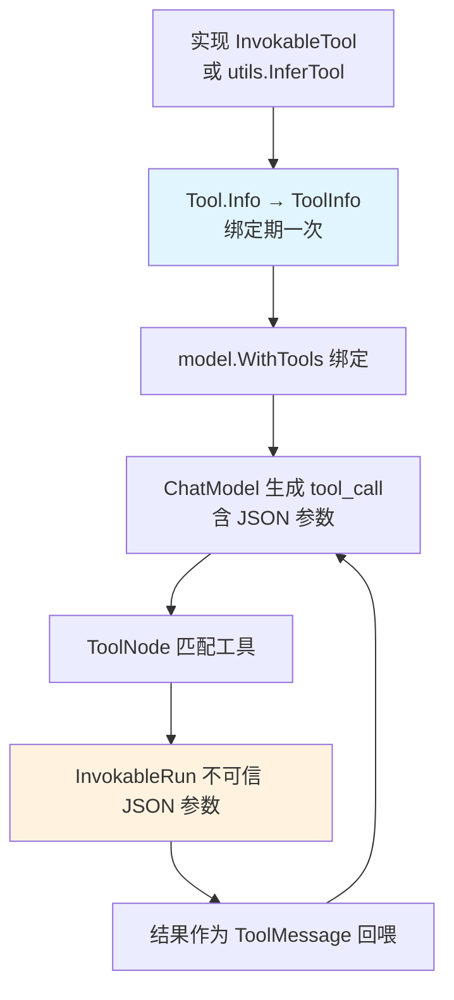

> eino「逐能力核对」系列第 2 篇。第一阶段第二项 **Function Calling**,结论:**✅ 一等实现,而且比多数框架切得更细**。三层架构与 `schema` 背景见 [第 1 篇]() 的公共背景一节。本篇的核心论点:工具调用真正难的不是「让模型调函数」,而是**管好模型和你代码之间那道不可信边界**——eino 的五接口分层,正是围绕这道边界设计的。

## 技术背景:工具是 LLM 唯一的「手」

一个纯语言模型能生成文本,但改变不了世界——查不了实时天气、下不了单、读不了数据库。Function Calling 是它伸出的唯一一只手:模型输出一个「我想调用 `get_weather(city=北京)`」的意图,你的运行时接住、真正执行、把结果喂回去。

要把一个外部能力接进模型,框架必须解决三件事:**描述**(告诉模型这能力叫什么、要什么参数)、**执行**(拿模型给的 JSON 参数真正跑)、**绑定**(把描述挂到模型上)。听起来直白,但每一环都藏着工程陷阱,而最深的一个在「执行」——因为**模型给你的 JSON 参数,是不可信输入**。

## 问题挑战:两道墙,一道边界

把工具接进模型,你会连续撞上两道墙:

**第一道墙:JSON Schema 是手写地狱。** 模型靠 JSON Schema 理解参数结构。手写 Schema 冗长、易错、和你的真实函数签名极易漂移——改了函数忘了改 Schema,模型就按过时的契约传参。

**第二道墙,也是本篇的主角:模型输出 JSON 参数是不可信的。** 很多人潜意识里把「模型生成的 tool_call 参数」当成自己代码内部的可信数据,直接 `json.Unmarshal` 完就往下游传。但模型会**幻觉出不存在的枚举值、越界的数字、格式不对的日期,甚至构造出带注入意图的字符串**。这道边界的性质,和「HTTP 请求体来自外部用户」完全一样——系统设计原则里那句「只在系统边界做校验」中的「边界」,模型输出就是其中一道。谁把它当可信内部数据,谁就会在生产里吃亏。

eino 的工具抽象,本质是围绕「如何规整地跨越这道边界」设计的。

## 方案演进:从手写 Schema 到反射生成再到富返回

工具抽象的演化,eino 走完了三级:

1. **手写实现 `InvokableTool`**:自己写 `Info` 返回 Schema、自己在 `InvokableRun` 里 `Unmarshal`。完全可控,但啰嗦。
2. **`utils.InferTool` 反射生成**:从普通 Go 函数的签名和 struct tag 自动推导 Schema。90% 场景的答案。
3. **`Enhanced` 变体**:返回结构化结果而非纯字符串,应对多模态等富返回场景。

这三级不是替代关系,而是**按信任与复杂度分层**。下面逐层拆。

## 架构设计:五个接口,层层递进

源码在 `components/tool/interface.go`。v0.8.12 一共**五个**接口,先看核心三个:

```go
// 最基础:提供工具元信息(名字、描述、参数 schema)
type BaseTool interface {
	Info(ctx context.Context) (*schema.ToolInfo, error)
}

// 同步调用
type InvokableTool interface {
	BaseTool
	InvokableRun(ctx context.Context, argumentsInJSON string, opts ...Option) (string, error)
}

// 流式返回
type StreamableTool interface {
	BaseTool
	StreamableRun(ctx context.Context, argumentsInJSON string, opts ...Option) (
		*schema.StreamReader[string], error)
}
```

注意 `InvokableRun` 的入参签名:**`argumentsInJSON string`**。框架非常诚实地把它标成一个「JSON 字符串」而不是某个结构体——因为在这一层,它就是一段**还没被验证过的、来自模型的文本**。跨越边界(反序列化 + 校验)是工具实现者的责任,框架不替你假装它是可信的。这个签名设计本身就是一种态度。

再看两个 **Enhanced 增强变体**:`EnhancedInvokableTool` / `EnhancedStreamableTool`,它们返回**结构化结果**而非纯字符串,用于多模态等需要富返回的场景。这是很多同类框架没有的一层——纯文本工具用核心三接口,富返回工具用 Enhanced 变体。「比多数框架更细」的具体所指就在这里。

`Info` 返回的 `ToolInfo` 是喂给模型的说明书:

```go
type ToolInfo struct {
	Name  string
	Desc  string
	Extra map[string]any
	*ParamsOneOf // 匿名嵌入:参数 schema
}
```

`Desc` 是模型判断「该不该用这个工具」的**唯一依据**。这点我要重锤一下:**工具选错,九成是 `Desc` 的锅,不是模型的锅**。写得含糊,模型要么不调、要么乱调。别写小作文,写清「做什么 + 何时用 + 何时别用」。这和 [第 10 篇 Skill]() 里 Description 决定 Skill 触发时机、[第 9 篇]() 里子 Agent 描述决定路由准确率,是同一条规律的三次出现。

## 源码解析:InferTool 的反射到底做了什么

手写 Schema 是地狱,所以主力姿势是 `utils.InferTool` 从函数反射生成:

```go
import "github.com/cloudwego/eino/components/tool/utils"

type WeatherReq struct {
	City string `json:"city" jsonschema:"description=城市名,例如 北京"`
	Unit string `json:"unit" jsonschema:"description=温度单位,enum=celsius,enum=fahrenheit"`
}
type WeatherResp struct {
	Temp int    `json:"temp"`
	Desc string `json:"desc"`
}

func getWeather(ctx context.Context, req *WeatherReq) (*WeatherResp, error) {
	return &WeatherResp{Temp: 26, Desc: "晴"}, nil
}

weatherTool, err := utils.InferTool("get_weather", "查询指定城市的实时天气", getWeather)
```

`InferTool` 内部做三件事,每件都值得看清:

1. **反射函数签名**:它约束你的函数形如 `func(ctx, *Req) (*Resp, error)`。反射拿到 `*Req` 的类型,遍历字段。
2. **解析 struct tag 生成 JSON Schema**:`json` tag 决定字段名,`jsonschema` tag 决定 `description` / `enum` / 必填等约束。`enum=celsius,enum=fahrenheit` 会生成一个枚举约束——这一步很关键,因为**枚举约束是把不可信边界往模型侧前移**:让模型在生成阶段就只能从合法值里选,而不是等它幻觉出 `unit=摄氏度` 你再在下游报错。
3. **包装成 `InvokableRun`**:自动 `json.Unmarshal(argumentsInJSON, &req)` → 调你的 `getWeather` → `json.Marshal` 返回值。跨边界的反序列化被封在这里,但**语义校验(城市是否存在、单位是否支持)仍是你函数体的责任**——反射能保证类型对,保证不了业务合法。

需要完全控制时(比如参数结构无法用 struct 表达、要动态生成 Schema),退回手写 `InvokableTool`。两条路按信任与复杂度选。

## 绑定:WithTools 是不可变的,且属于启动期

工具做好后绑定到 ChatModel。eino 用 `WithTools`,返回一个「知道这些工具」的**新模型**(不可变风格,不原地改):

```go
infos := make([]*schema.ToolInfo, 0, len(tools))
for _, t := range tools {
	info, _ := t.Info(ctx)  // Info 在绑定期调一次,不在请求路径
	infos = append(infos, info)
}
boundModel, err := chatModel.WithTools(infos)
```

从性能视角,这里有个容易忽略的点:**`Info` 应该在绑定期调用一次,而不是每请求都调**。工具的 `ToolInfo` 是静态的(名字、描述、Schema 不随请求变),绑定一次得到的 `boundModel` 复用即可。把 `WithTools` 放进请求路径,等于每个请求都重新反射一遍所有工具的 Schema——在多工具、高 QPS 下是纯浪费。

在 Agent 场景里你通常**不用手动 `WithTools`**——把工具交给 ReAct 的 `ToolsConfig`,框架自动完成绑定和 ToolNode 装配(见 [第 6 篇 ReAct]())。



## 生产实践:把工具当成微服务来运维

工具在生产里的行为特征,和「一个被高频调用的下游微服务」几乎一样。所以运维纪律也照搬:

- **控制工具数量,别一次绑几十个**:工具越多,prompt 越大、选择准确率越低——这是实测规律,不是玄学。工具多时先做一个「路由」环节筛出候选子集再绑定,或用 [第 10 篇 Skill]() 的渐进式披露。
- **每个工具内部都要有超时**:工具多是网络调用,务必用 `ctx` 控超时。一个卡住的工具会拖垮整轮 Agent——而 Agent 一轮可能已经烧了好几次模型调用,代价比普通接口超时高得多。
- **幂等只读工具加缓存**:天气、汇率这类查询,加一层短 TTL 缓存能显著降 Agent 端到端延迟和下游压力。
- **错误优先回喂给模型,而非中断**:把工具错误包成 `ToolMessage`(比如「城市不存在,请确认拼写」)回传,让模型自我纠偏,通常比直接 `return err` 中断整个 Agent 更鲁棒。这是 Agent 相比传统 pipeline 的一个反直觉优势——它能「读懂」错误并重试。但要设纠偏次数上限,别让它无限打转。
- **把模型输出当不可信输入校验**:重复第三遍,因为它最重要。枚举约束前移到 Schema、边界处做语义校验、拒绝越界参数。这道边界守不住,后面所有智能体能力都建在流沙上。

## 一个常见误解:eino 的「Skills」在哪

很多人带着 Claude 的「加载 skill」心智来找 eino,在 `components/tool` 里翻 Skills 抽象——**翻不到**。在组件层,工具的等价物就是 Tool 本身;真正对标 Anthropic Agent Skills 的实现在 adk 层,是 [第 10 篇 Skill]() 的主题。别在错误的层找对的东西。

## 小结

Function Calling 的表面是「让模型调函数」,里子是「管好一道不可信边界」。eino 的五接口分层——三个核心 + 两个 Enhanced——加上 `InferTool` 的反射生成,把「描述、执行、绑定」三件事收拾得干净,而 `argumentsInJSON string` 这个诚实的签名时刻提醒你:那段 JSON 来自模型,不是来自你。

| 项 | 结论 |
|---|---|
| 实现程度 | ✅ 一等(5 接口) |
| 源码 | `components/tool/interface.go` + `components/tool/utils` |
| 核心 API | `utils.InferTool(name, desc, fn)` + `chatModel.WithTools(infos)` |
| 特色 | `EnhancedInvokableTool` / `EnhancedStreamableTool` 富返回变体 |
| 主线纪律 | 模型输出的 JSON 参数是不可信输入,枚举前移 + 边界校验 |

下一篇 **RAG**——看 document / indexer / retriever 三个组件怎么串成检索链路,以及为什么「检索」在 eino 里天然是一条可编排的图。

> **系列导航 · 逐能力核对**
> 第一阶段·掌握:[Prompt]() · **Function Calling(本篇)** · [RAG]() · [Embedding]()
> 第二阶段·学习:[compose]() · [ReAct]() · [MCP]() · [Memory]()
> 第三阶段·企业级:[多智能体]() · [Skill]() · [Runtime]() · [Evaluation]()
