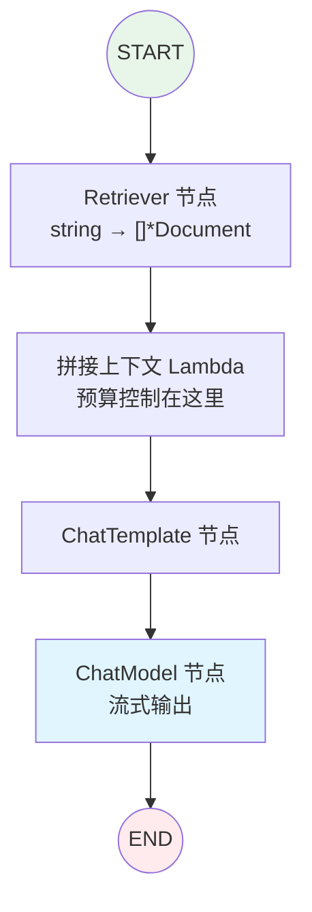

> eino「逐能力核对」系列第 3 篇。第一阶段第三项 **RAG**,结论:**✅ 一等链路**。三层架构背景见 [第 1 篇]()。本篇两条主线:一是 RAG 在 eino 里为什么天然是一张**可编排、可并发、可流式**的图;二是一个反复咬人的生产教训——**RAG 失败是静默的,模型会拿着错误的上下文自信地胡说。**

## 技术背景:RAG 补的是模型的两个先天缺陷

大模型有两个改不了的先天缺陷:**知识截止**(训练完就冻结,不知道之后发生的事)和**私有盲区**(你公司内部的文档、工单、代码,它从没见过)。RAG(检索增强生成)的思路很朴素:回答前,先从外部知识库检索相关材料,塞进上下文,让模型「开卷考试」。

但「朴素的思路」不等于「朴素的工程」。RAG 在生产里是延迟、成本、质量三者最难平衡的一环,而 eino 的处理方式,恰好把这三者的权衡点暴露得很清楚。

## 架构设计:RAG 不是组件,是三个组件的协作 + 两张图

第一个要纠正的认知:**RAG 在 eino 里不是单个组件**,而是 `components` 里三个组件协作的链路:

- `components/document`(loader / transformer / parser)—— 加载与切分文档
- `components/indexer` —— 把文档向量化后写入索引
- `components/retriever` —— 按 query 召回相关文档

三个接口都在 core;具体的向量库、Reranker、文档解析器实现在 **eino-ext**。「向量化」这一步依赖 Embedding 组件——[第 4 篇]() 专讲,本篇聚焦检索链路。

第二个要建立的结构:**RAG 天然是两张图,不是一张。**

**离线图**:文档 → `document` 加载切分 → `Embedding` 向量化 → `indexer` 写入向量库。在数据准备阶段跑,**不在请求路径上**,可以慢、可以批、可以夜里跑。

**在线图**:用户 query → `retriever` 召回 → 拼接上下文 → ChatModel 生成。**在请求路径上,每一毫秒都算进用户等待**。

把这两张图混在一起写,是我见过最常见的架构错误——它会让你在优化查询延迟时被建索引逻辑绊住,反之亦然。分开编译、分开部署,是第一条纪律。

## 核心实现:在线检索图

在线这段用 `compose.Graph` 编排:

```go
func buildRAG(ctx context.Context, rtr retriever.Retriever,
	tpl prompt.ChatTemplate, model model.BaseChatModel) (
	compose.Runnable[string, *schema.Message], error) {

	g := compose.NewGraph[string, *schema.Message]()

	// 检索节点:string -> []*schema.Document
	_ = g.AddRetrieverNode("retrieve", rtr)

	// 把文档拼成模板输入(注意:这里是做预算控制的地方)
	_ = g.AddLambdaNode("build_ctx", compose.InvokableLambda(
		func(ctx context.Context, docs []*schema.Document) (map[string]any, error) {
			var sb strings.Builder
			budget := 3000 // 上下文预算,不是全塞
			for _, d := range docs {
				if sb.Len()+len(d.Content) > budget {
					break
				}
				sb.WriteString(d.Content + "\n")
			}
			return map[string]any{"context": sb.String()}, nil
		}))

	_ = g.AddChatTemplateNode("prompt", tpl)
	_ = g.AddChatModelNode("model", model)

	_ = g.AddEdge(compose.START, "retrieve")
	_ = g.AddEdge("retrieve", "build_ctx")
	_ = g.AddEdge("build_ctx", "prompt")
	_ = g.AddEdge("prompt", "model")
	_ = g.AddEdge("model", compose.END)

	return g.Compile(ctx)
}
```



注意 `build_ctx` 里我特意写了预算控制,而不是「把召回的文档全拼进去」。这是有意的——见后面「性能」一节。

## 源码解析:一个非流节点接在流前面,会发生什么

链路里 `build_ctx`、`prompt` 是**非流**节点,末端 `model` 是**流**节点。但外层 `Stream` 依然拿到完整的流:

```go
stream, _ := runnable.Stream(ctx, "什么是向量数据库?")
defer stream.Close()
for {
	msg, err := stream.Recv()
	if err != nil { break } // io.EOF
	fmt.Print(msg.Content)
}
```

这背后是 eino 最硬核的机制:框架用 **concat/box 自动缝合**流与非流([第 5 篇 compose]() 详解)。在 RAG 场景,关键结论是:**检索、拼接这些非流步骤在前,不影响末端模型输出的流式性**——用户看到的仍是逐字吐出的回答,首 token 延迟只被「检索 + 拼接」这段固定开销推后,而不是被整条链路 buffer 住。

这点在架构上很重要:它意味着**检索的延迟是可预算的常数**(检索完才开始生成),你可以精确地对用户说「你会先等 X 毫秒检索,然后开始看到流式回答」,而不是笼统的「等着」。

## 性能优化:多路召回自动并发,以及 top-k 的延迟税

两个真实的优化杠杆。

**其一,多路召回自动并发。** 生产级 RAG 很少只有一路向量检索,通常是「向量检索 + 关键词/BM25 检索」混合召回。在 eino 里,把它们拆成从 `START` 出发的**两条独立分支**,`build_ctx` 处 Merge——**eino 自动并发执行这两路,一行 goroutine 都不用写**(无依赖节点自动并行是 compose 的红利,见 [第 5 篇]())。两路召回各 40ms,并发后整体还是 40ms,不是 80ms。这是把架构表达力直接换成延迟收益的典型例子。

**其二,top-k 是有延迟税的。** 召回数量 top-k 调大,召回率上去了,但代价是双重的:检索本身更慢、拼进上下文的文本更长(模型 prefill 更慢、更贵)。这就是为什么 `build_ctx` 要做**预算控制**而不是全塞——上下文不是越多越好,超过某个点,无关文档会稀释模型注意力,既贵又降质。我的经验值:先用小 top-k + 高质量 Reranker,而不是大 top-k 裸拼。Reranker(eino-ext 提供)加在 `retrieve` 和 `build_ctx` 之间,用少量精排结果替代大量粗排结果。

## 生产实践:RAG 失败是静默的,你必须主动观测检索质量

这是本篇最想留下的一条。传统系统出错会抛异常、会 500、会有栈——**RAG 出错不会**。检索召回了一堆不相关的文档,模型不会报错,它会**拿着错误的上下文,语法通顺、语气自信地给出一个错误答案**。用户不投诉的时候,你甚至不知道它错了。

所以 RAG 的可观测性不能只盯着「有没有异常」,必须盯**检索质量本身**:

- **把每次召回的 doc id、score、query 落日志**:线上排查「为什么这个问题答错了」,第一步永远是看当时召回了什么。没有这个日志,你在盲猜。
- **离线建召回评测集**:一批「问题 → 应该召回的文档」的标注,定期跑召回率/命中率。切分策略、embedding 换型、top-k 调整,都在这个评测集上验证,而不是拍脑袋。这和 [第 12 篇]() 的评测思路一脉相承。
- **检索质量在数据侧,不在框架侧**:切分粒度(`document/transformer`)、embedding 选型、top-k、Reranker——这些决定 RAG 效果的因素**全在你的数据准备和组件配置里**,框架只负责把链路串对、串高效。别指望换个框架 RAG 效果就好了,那是数据工程问题。

其余几条:

- **索引与查询分离部署**:离线图和在线图是两个部署单元,资源画像完全不同(一个吃吞吐,一个吃延迟)。
- **别把整段长文档当一个 chunk**:切分粒度直接决定召回精度。太大则一个 chunk 混入无关内容拉低精度,太小则语义被切碎。这是 RAG 最需要调的旋钮之一。

## 小结

RAG 在 eino 里是一条链路而非一个组件,而且是一条**要算延迟预算、要主动观测质量**的链路。compose 的流缝合让检索不牺牲流式体验,自动并发让混合召回不牺牲延迟,但框架能给的到此为止——**召回准不准是数据工程,不是框架特性**。记住那条静默失败的教训:没有检索日志和召回评测集的 RAG,是一个你无法排查、无法优化的黑盒。

| 项 | 结论 |
|---|---|
| 实现程度 | ✅ 一等链路 |
| 源码 | `components/document` / `components/indexer` / `components/retriever` |
| 编排 | `compose.Graph` + `AddRetrieverNode`,流自动缝合、多路召回自动并发 |
| 性能杠杆 | 混合召回并发 + 小 top-k + Reranker + 上下文预算控制 |
| 生产铁律 | 失败静默,必须落检索日志 + 建召回评测集 |

下一篇 **Embedding**——RAG 的上游,把文本变向量的那一步,以及它为什么是纯粹的「接口在 core、实现在 eino-ext」。

> **系列导航 · 逐能力核对**
> 第一阶段·掌握:[Prompt]() · [Function Calling]() · **RAG(本篇)** · [Embedding]()
> 第二阶段·学习:[compose]() · [ReAct]() · [MCP]() · [Memory]()
> 第三阶段·企业级:[多智能体]() · [Skill]() · [Runtime]() · [Evaluation]()
