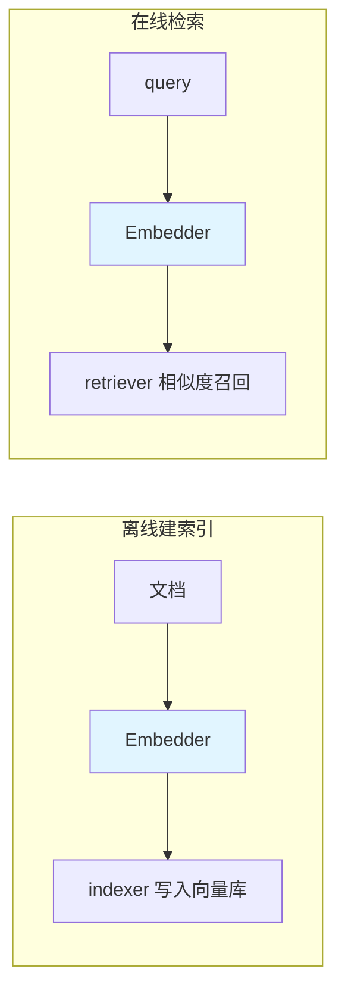

> eino「逐能力核对」系列第 4 篇,第一阶段收官项 **Embedding**,结论:**✅ 接口在 core,实现在 eino-ext**。三层架构背景见 [第 1 篇]()。本篇讲一个反差:Embedding 是全系列**接口最简单**的组件——只有一个方法;但它是**迁移代价最高**的一环——动一下,可能意味着一次全量重建索引的运维工程。看似平凡的组件,恰恰是架构评审时最该问清楚的地方。

## 技术背景:语义检索的地基

Embedding 把文本映射成高维向量,让「语义相近」变成「向量空间中距离相近」。[第 3 篇 RAG]() 的召回、聚类、去重、相似问题匹配——所有「按意思找」的能力,底下都是 embedding。它是地基:平时你不会盯着地基看,但地基一旦要改,上面盖的楼全得跟着动。

## 架构设计:一个方法的接口,是一种设计表态

源码是 `components/embedding` 定义的接口,极简到只有一个方法:

```go
// components/embedding
type Embedder interface {
	EmbedStrings(ctx context.Context, texts []string, opts ...Option) ([][]float64, error)
}
```

输入一批文本,输出一批向量。就这么干净。但这个签名里有两个刻意的设计,值得 Staff+ 视角停一下:

**第一,输入是 `[]string` 而不是 `string`。** 接口从签名层面就**强制你按批思考**。这不是便利,是引导——embedding 的经济性完全建立在批量之上(见性能一节),一个只收单条的接口会诱导用户写出逐条调用的灾难代码。接口设计在这里替使用者做了正确的默认。

**第二,和 ChatModel 一样,core 只有 `Embedder` 接口,实现全在 eino-ext。** OpenAI、豆包、各种本地 embedding 模型都是独立实现,你用哪个才引入哪个依赖:

```go
import "github.com/cloudwego/eino-ext/components/embedding/openai"

emb, err := openai.NewEmbedder(ctx, &openai.EmbeddingConfig{
	Model: "text-embedding-3-small",
})
vecs, err := emb.EmbedStrings(ctx, []string{"向量数据库是什么", "什么是 RAG"})
// vecs[0]、vecs[1] 分别是两句话的向量,类型 [][]float64
```

这个「接口在 core、实现在 eino-ext」的切分,让 embedding 的选型变成一个**可替换的配置决策**而非架构决策——只要都实现 `Embedder`,业务代码一行不改就能从 API embedding 切到本地 embedding。至少在**代码层面**是这样。但下面会讲到,在**数据层面**,切换的代价一点都不小。

## 它在链路里的位置:上游的上游,且被注入

Embedding 单独看没戏,价值全在 RAG 链路里,且出现在两处对称的位置:



- **离线**:`indexer` 写文档进向量库前,先用 `Embedder` 把文档向量化。
- **在线**:`retriever` 拿到 query 后,先用 `Embedder` 把 query 向量化,再去向量库匹配。

所以你通常不直接调 `EmbedStrings`,而是把 `Embedder` **作为组件注入 indexer / retriever 的构造**,由它们内部调用。直接调用的场景主要是自建检索或做向量实验。这个「被注入」的位置很关键——它意味着离线和在线两处**必须注入同一个 embedder**,否则就踩进下面这个坑。

## 生产实践:那个「换模型 = 重建索引」的迁移工程

这是本篇的核心,也是我把它称为「最昂贵的迁移」的原因。

Embedding 有一条铁律:**建索引和检索必须用同一个模型、同一个版本。** 原因是不同模型(甚至同模型不同版本)产出的向量空间不兼容——用模型 A 建的库,拿模型 B 的 query 向量去匹配,召回结果基本是噪声。而且它**不会报错**(呼应 [第 3 篇]() 的「RAG 失败是静默的」),只是默默地召回一堆不相关的东西。

由此推出一个很多团队没预算到的事实:**升级 embedding 模型,不是改个配置,是一次全量数据迁移。**

设想你的库里有千万级文档,想从 `text-embedding-3-small` 换成效果更好的新模型。你要做的是:

1. 用新模型**重新 embedding 全部文档**(千万次向量化调用,一笔实打实的时间和 API 成本);
2. 建一个**新的向量索引**(维度可能都变了——见下条);
3. 灰度切流,验证召回质量不回退;
4. 下线旧索引。

这是一个标准的**双写/影子索引迁移工程**,不是一次 deploy。所以「embedding 选型」这个决策的真实权重,远高于它「一个方法的接口」给人的印象——它绑定了你未来的迁移成本。架构评审时,我一定会问:embedding 模型是谁、维度多少、换型预案是什么。看似最不起眼的组件,问题最该问在前面。

其余生产要点:

- **维度要和向量库对齐**:`text-embedding-3-small` 是 1536 维,建库的维度配置必须匹配,否则写入直接失败。换模型常伴随维度变化,这也是上面「建新索引」的原因之一。
- **批量是经济性命门**:`EmbedStrings` 收 `[]string`,离线建索引时务必按批(几十到上百条)灌,而不是逐条调。批量能把 API 往返次数、连接开销摊薄一个数量级——这直接决定离线建索引跑几小时还是几天。
- **稳定文本的向量可以缓存**:同一段文档在没变更时,它的向量是确定的。对增量更新场景,用内容 hash 做缓存键,避免重复 embedding 没变过的文档,能省下大量重建成本。
- **选型看部署形态**:走 API(OpenAI/豆包)简单但有网络成本和**数据出域**顾虑;本地模型省成本、数据不出域,但要自己扛推理资源和运维。数据合规敏感的场景,这一条往往是决定性的,而它恰好是 core/eino-ext 切分让你能平滑切换的地方。
- **小模型 vs 大模型是成本/质量权衡**:更大的 embedding 模型召回更准但更贵更慢、维度更高(索引更占内存)。别默认选最大的,用 [第 12 篇]() 的召回评测集在你自己的数据上量一下,常常小模型 + 好 Reranker 就够。

## 小结

Embedding 的接口简单到一句话就能讲完,但它在架构上的分量全藏在数据层:它决定了你的语义检索地基,而地基的迁移是全量重建。`EmbedStrings([]string)` 这个强制批量的签名、core/eino-ext 的可替换切分,是框架层面的好设计;但「同模型同版本」这条铁律和「换型即迁移」这个代价,是框架替你解决不了、必须在选型阶段就想清楚的工程现实。

| 项 | 结论 |
|---|---|
| 实现程度 | ✅ 接口在 core |
| 源码 | `components/embedding`(`Embedder` 接口) |
| 核心 API | `emb.EmbedStrings(ctx, texts)` → `[][]float64` |
| 实现位置 | eino-ext(OpenAI / 豆包 / 本地模型等) |
| 选型分量 | 接口最简,迁移最贵:换模型 = 全量重建索引,评审要前置问清 |

第一阶段「掌握」四项(Prompt / Function Calling / RAG / Embedding)**全部 ✅ 一等**,地基扎实。下一阶段「学习」进入编排与智能体——从 [第 5 篇 compose]() 开始,那是 eino 最硬核、也最能体现其「流优先」野心的一层。

> **系列导航 · 逐能力核对**
> 第一阶段·掌握:[Prompt]() · [Function Calling]() · [RAG]() · **Embedding(本篇)**
> 第二阶段·学习:[compose]() · [ReAct]() · [MCP]() · [Memory]()
> 第三阶段·企业级:[多智能体]() · [Skill]() · [Runtime]() · [Evaluation]()
