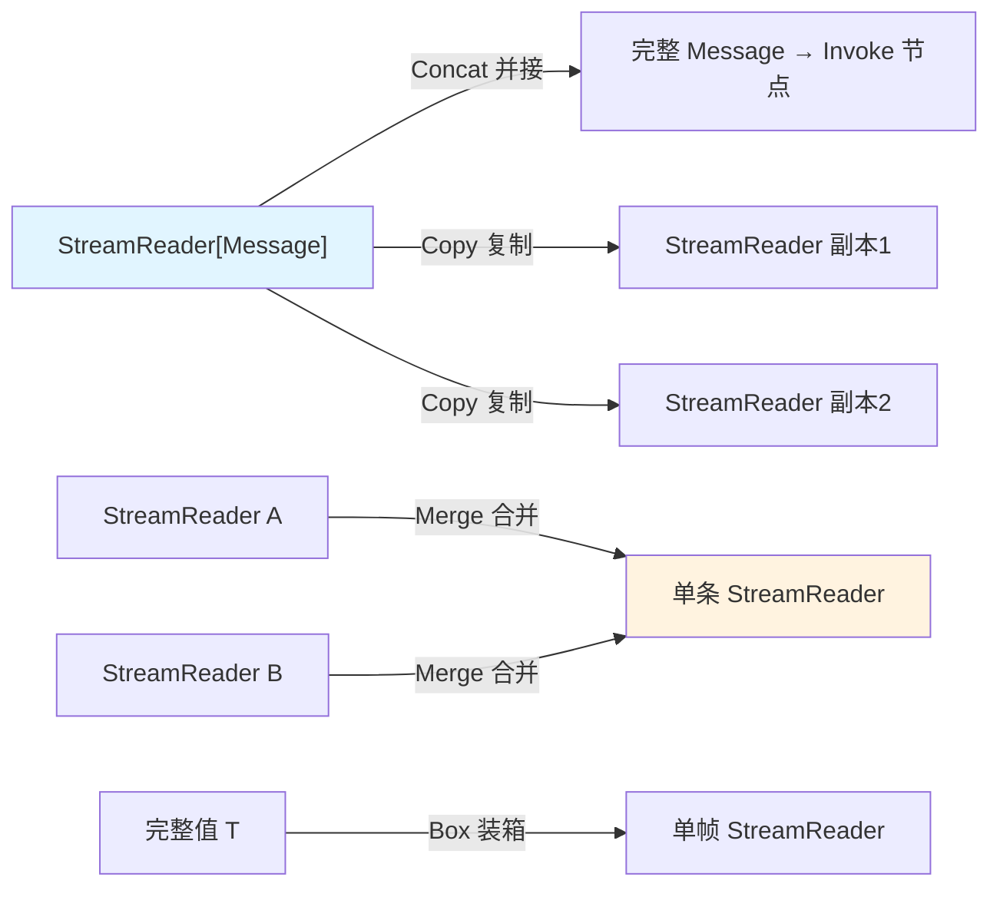

> eino「逐能力核对」系列第 5 篇。第二阶段第一项 **LangGraph 思想(compose)**,结论:**✅ 一等实现,而且是 eino 最硬核、最值得单独写一篇深读的一层**。三层架构背景见 [第 1 篇]()。如果整个系列只让我留一篇,我留这篇——因为 compose 层解决的那个问题(**如何在一张图里自动缝合流式与非流式节点**),是所有「流优先」框架都绕不过、而多数框架用回调地狱硬扛的真问题。eino 的答案干净得像一个数学结构。

## 技术背景:把 LLM 应用建模成有向图

「LangGraph 思想」的核心,是把 LLM 应用建模成一张**有向图**:节点是组件(模型、工具、检索器、自定义逻辑),边是数据流,支持分支与循环。ReAct 的 reason-act 循环是一张带环的图,RAG 是一条链,多智能体是子图委派——[第 6 篇]()、[第 3 篇]()、[第 9 篇]() 讲的所有高级能力,底座都是这一层。

但「连图」本身不难,难的是**流**。这才是 compose 层真正硬核的地方。

## 问题挑战:流与非流的组合爆炸

考虑一个最朴素的需求:一条链路 `检索 → 拼上下文 → 模型 → 后处理`。

- 模型是**流式**的(逐 token 吐),你想要首 token 尽快到达用户;
- 检索、拼上下文是**非流式**的(拿到完整输入才能算);
- 后处理可能又是流式的(边收边转)。

现在问题来了:**一个只会吃「完整值」的非流节点,怎么接收上游的流?一个只会吐「完整值」的非流节点,怎么给下游提供流?** 每个节点理论上有「输入是否为流 × 输出是否为流」四种形态,任意两个节点相邻就有组合。如果让每个组件自己处理所有相邻可能,就是 N×N 的适配地狱——这正是很多框架里回调套回调、`async for` 套 `async for` 的由来。

再叠加两个流特有的约束,难度还要上一个台阶:

- **流只能读一次**:`StreamReader` 被一个下游 `Recv` 完,就没了。一个流要喂给两个下游怎么办?
- **多个上游汇聚**:一个节点有两个流式上游,怎么合成一条给它?

eino 用一个「四范式 + 四运算」的结构,把这整个组合爆炸消解掉了。

## 架构设计:四执行范式,你只实现一两个

eino 里每个可运行单元(`Runnable`)理论上有四个方法,对应输入/输出是否为流的四种组合:

| 方法 | 输入 | 输出 |
|------|------|------|
| `Invoke` | 非流 | 非流 |
| `Stream` | 非流 | 流 |
| `Collect` | 流 | 非流 |
| `Transform` | 流 | 流 |

```go
type Runnable[I, O any] interface {
	Invoke(ctx context.Context, input I, opts ...Option) (O, error)
	Stream(ctx context.Context, input I, opts ...Option) (*schema.StreamReader[O], error)
	Collect(ctx context.Context, input *schema.StreamReader[I], opts ...Option) (O, error)
	Transform(ctx context.Context, input *schema.StreamReader[I], opts ...Option) (*schema.StreamReader[O], error)
}
```

**这里是整个设计的枢纽**:你实现一个组件时,**只需提供其中一两个方法**——只有同步逻辑就实现 `Invoke`(用 `InvokableLambda`),只有流式逻辑就实现 `Stream`(用 `StreamableLambda`)。**框架自动帮你补全另外几个。** 一个只会 `Invoke` 的节点,框架能自动给它造出 `Stream` / `Collect` / `Transform` 的行为,让它无缝接进任意流式链路。

组件作者从此**不用关心下游是不是流**。N×N 的适配矩阵,坍缩成「每个节点各自实现最自然的那一两个方法」。而补全的魔法,靠的是下面四个原子运算。

## 核心实现:流的四则运算 concat / box / merge / copy

当框架要把一个只实现了 `Invoke`(非流)的节点接进流式链路,它需要四种原子操作在流和完整值之间转换、以及处理流的分合:

- **Concat(并接)**:把 `StreamReader[T]` 的所有帧收集拼成完整 `T`。比如把流式 Message 的每个 chunk 的 `Content` 拼成完整字符串,喂给只吃完整值的 `Invoke`。这是「流 → 非流」的桥。
- **Box(装箱)**:反过来,把完整 `T` 包成只有一帧的 `StreamReader[T]`,喂给需要流的下游。这是「非流 → 流」的桥。
- **Merge(合并)**:一个节点有多个上游时,把多个 `StreamReader[T]` 合并成一条。
- **Copy(复制)**:一个流要被多个下游消费时,复制成 N 份(流只能读一次,必须复制)。



四个操作组合起来,框架就能在任意「流/非流」节点之间自动缝合。**这就是四范式补全的实现底座**:框架发现上游给流、下游只有 `Invoke`,就自动插一次 Concat;下游要流、上游只有完整值,就自动 Box;一对多就 Copy,多对一就 Merge。写组件时你完全不用碰这四个操作——但理解它们,你就理解了 eino 为什么敢称「流优先」,以及下面每一条性能陷阱的根因。

## 三种编排入口:Graph / Chain / Workflow

复杂度递增,按需选:

- **Chain**:线性语法糖,`Append` 帮你把 `AddNode + AddEdge` 一次做完。无分支流程首选。
- **Graph**:带条件分支(`AddBranch`)与循环。Agent 的 reason-act 循环就是它。
- **Workflow**:字段级映射,把上游输出的某个字段精细搬到下游输入的某个字段,省掉一堆胶水 Lambda。

Graph 的分支能力是 Agent 的基础。看一段带循环的骨架——这本质就是一个 ReAct:

```go
g := compose.NewGraph[map[string]any, *schema.Message]()
_ = g.AddChatModelNode("model", model)
_ = g.AddToolsNode("tools", toolsNode)

// 根据模型输出是否包含 tool_call 决定走向
_ = g.AddBranch("model", compose.NewStreamGraphBranch(
	func(ctx context.Context, sr *schema.StreamReader[*schema.Message]) (string, error) {
		defer sr.Close() // 关键:分支函数拿到流,判断完必须 Close
		msg, err := sr.Recv()
		if err != nil {
			return "", err
		}
		if len(msg.ToolCalls) > 0 {
			return "tools", nil // 有工具调用 → 去 tools 节点
		}
		return compose.END, nil
	},
	map[string]bool{"tools": true, compose.END: true},
))
_ = g.AddEdge("tools", "model") // 工具执行完回到 model,形成循环
```

注意分支函数拿到的是 `StreamReader`,用 `NewStreamGraphBranch`——**一旦在流早期检测到 tool_call 就能尽早决策,不必等整条消息生成完**。这是流式分支相对非流式分支的实打实优势:路由决策发生在第一帧,而不是全消息 buffer 之后。eino 也提供非流的 `NewGraphBranch`,框架自动适配。

## 性能优化:每一条都是四则运算的直接推论

理解了 concat/box/merge/copy,下面的性能陷阱就不是「注意事项清单」,而是**可推导的结论**:

- **警惕隐式 Concat 吃掉首字节优势**:把一个非流节点接在流式模型后面,框架会 Concat 整条流成完整值再往下走——**首 token 延迟优势瞬间归零**,因为用户要等整条消息拼完。追求首 token 延迟,就让热路径**从头到尾全流式**(每个节点都实现 `Stream`/`Transform`),别让任何一个非流节点横在中间做 Concat。这是 RAG/对话流式体验的头号杀手。
- **Copy 有内存成本**:一个流被 N 个下游消费会 Copy 成 N 份,每份都要独立缓冲。扇出很大时(比如同一个模型输出同时喂给日志、审计、下游模型)注意内存,必要时对不需要实时的分支先 Concat 落地再处理。
- **自动并发是免费的延迟收益**:没有边相连(无依赖)的节点,eino 自动并发执行,一行 goroutine 都不用写。**刻意**把独立的多路检索、并行工具拆成平行分支,能把串行延迟压成并行延迟——这是 [第 3 篇 RAG]() 混合召回提速的原理。
- **Compile 一次,复用多次**:`Compile` 遍历每条边做类型对齐检查(编译期泛型 + Compile 期双重保障),编译后的 `Runnable` 并发安全且可复用。放全局或 `sync.Once`,**别每请求都 Compile**——那等于把启动期开销塞进热路径。

## 生产实践:一个真实的 goroutine 泄漏

上面分支代码里的 `defer sr.Close()` 不是装饰,是我用线上事故换来的肌肉记忆。

`StreamGraphBranch` 的函数通常只 `Recv` 第一帧就够判断路由了,剩下的帧不需要。但**如果你不 `Close()` 那个 `StreamReader`,产生这条流的上游 goroutine 会一直阻塞在写侧**——因为没人再读了。单个请求看不出问题,但在持续流量下,这种泄漏会缓慢累积,goroutine 数一路爬升,最终 OOM。表现极具迷惑性:内存缓慢增长,没有明显的分配热点,因为泄漏的是阻塞的 goroutine 而非堆对象。

教训沉淀成一条铁律:**任何拿到 `StreamReader` 而不打算读到 EOF 的地方,必须 `Close()`。** 分支函数、提前返回、错误路径,一个都不能漏。这是 eino 流式编程和普通 Go 编程最不一样、也最容易翻车的地方。

其余:

- **Graph 支持环但不阻止死循环**:Agent 场景必须自己加迭代上限(见 [第 6 篇]() 的 `MaxStep`),否则一个不肯停的模型能把你的图跑成无限循环。
- **类型不对齐在 Compile 期就炸**:`compose.NewChain[string, int]()` 后接一个输出 `*Message` 的模型,Compile 直接报错。享受这个红利——把类型错误留在启动期。

## 小结

compose 是 eino 的心脏。它把「流与非流的组合爆炸」这个所有流优先框架的公共难题,用「四执行范式(你只实现一两个)+ concat/box/merge/copy(框架自动缝合)」这个近乎数学结构的方案解掉了。理解了这一层,你不仅理解了 eino 的编排,还理解了它每一条性能建议的根因,以及 ReAct、多智能体这些上层能力为什么能那么干净地建在它之上。

| 项 | 结论 |
|---|---|
| 实现程度 | ✅ 一等,最硬核 |
| 源码 | `compose/`(graph/generic_graph/chain/workflow) |
| 核心机制 | 四执行范式(实现一两个,自动补全)+ concat/box/merge/copy 缝合 |
| 性能主线 | 隐式 Concat 杀首 token;Copy 有内存税;无依赖节点自动并发;Compile 复用 |
| 生产铁律 | 拿到 `StreamReader` 不读完就必须 `Close`,否则 goroutine 泄漏 |

下一篇 **ReAct Agent**——看 eino 如何把这张「带循环的 Graph」封装成会「思考-行动」的智能体,以及一个必须讲清的坑:v0.8.12 里有两个 react。

> **系列导航 · 逐能力核对**
> 第一阶段·掌握:[Prompt]() · [Function Calling]() · [RAG]() · [Embedding]()
> 第二阶段·学习:**compose(本篇)** · [ReAct]() · [MCP]() · [Memory]()
> 第三阶段·企业级:[多智能体]() · [Skill]() · [Runtime]() · [Evaluation]()
