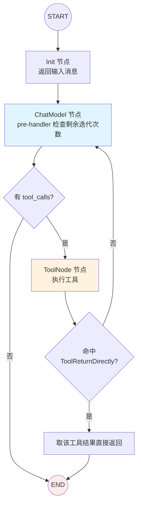

> eino「逐能力核对」系列第 6 篇。第二阶段第二项 **Agent Workflow(ReAct)**,结论:**✅ 一等实现,但有个必须先讲清的工程陷阱——v0.8.12 里有两个 react,抄错 API 是真会编译不过的**。三层架构见 [第 1 篇](),带循环的 Graph 与流缝合见 [第 5 篇]()。本篇的贯穿视角:**ReAct 不只是一个 Agent 范式,它是一台会自己烧钱、会自己陷入死循环的循环系统——你要用「成本治理」的眼光设计它。**

## 技术背景:ReAct 是 agentic 系统的原子

ReAct(Reasoning + Acting)是当下最主流的 Agent 范式:模型先推理,需要就调工具,拿到结果再推理,循环到给出答案。[第 9 篇]() 的多智能体、[第 10 篇]() 的 Skill,底下的执行单元几乎都是一个 ReAct。它在 eino 里不是黑盒,而是 [第 5 篇]() 那张**带循环的 Graph** + 三个关键机制。

但在写任何代码之前,得先拆掉一个几乎所有二手教程都埋错的雷。

## 问题挑战一:两个 react,抄错就编译不过

v0.8.12 里「react」有两处,字段名和类型都不一样。这不是学术洁癖——**网上大量教程贴的是不存在的 API,照抄直接编译报错**,这是实打实的工程时间损耗。

**① 讲内部机制**参考的是 ADK 私有配置 `adk/react.go` 的 `reactConfig`——揭示所有旋钮,但**不对外**:

```go
// adk/react.go —— 私有,仅用于理解机制
type reactConfig struct {
	model               model.BaseChatModel
	toolsConfig         *compose.ToolsNodeConfig
	toolsReturnDirectly map[string]bool  // 私有版:map[string]bool
	maxIterations       int              // 私有版叫 maxIterations,默认 20
	agentName           string
}
```

**② 写实际代码**用的是公开包 `flow/agent/react` 的 `AgentConfig`:

```go
// flow/agent/react —— 这才是你该 import 的公开 API
type AgentConfig struct {
	ToolCallingModel   model.ToolCallingChatModel  // 不是 Model
	ToolsConfig        compose.ToolsNodeConfig
	MaxStep            int                         // 公开版叫 MaxStep,不是 MaxIterations
	ToolReturnDirectly map[string]struct{}         // 是 map[string]struct{},不是 map[string]bool
	// Model 字段已 Deprecated
}

func NewAgent(ctx context.Context, cfg *AgentConfig) (*Agent, error)
```

> ⚠️ 划重点:**不存在** `adk/prebuilt/react` 这个导入路径,也**不存在** `react.Config{Model, MaxIterations, ToolsReturnDirectly: map[string]bool}` 这个构造。公开 API 只有 `flow/agent/react.NewAgent(ctx, *react.AgentConfig{...})`,字段是 `ToolCallingModel` / `MaxStep` / `ToolReturnDirectly map[string]struct{}`。为什么公开用 `map[string]struct{}` 而非私有的 `map[string]bool`?因为它表达的是**集合语义**(某工具在不在直返名单里),`struct{}` 零内存、无「值为 false 算不算在内」的歧义——这是 Go 里表达 set 的地道写法,一个小而准的品味细节。

正确构造:

```go
import (
	"github.com/cloudwego/eino/flow/agent/react"
	"github.com/cloudwego/eino/components/tool"
	"github.com/cloudwego/eino/components/tool/utils"
	"github.com/cloudwego/eino/compose"
)

func newAgent(ctx context.Context, cm model.ToolCallingChatModel) (*react.Agent, error) {
	weatherTool, _ := utils.InferTool("get_weather", "查询城市实时天气", getWeather)

	return react.NewAgent(ctx, &react.AgentConfig{
		ToolCallingModel: cm,
		ToolsConfig: compose.ToolsNodeConfig{
			Tools: []tool.BaseTool{weatherTool},
		},
		ToolReturnDirectly: map[string]struct{}{"get_weather": {}}, // 集合语义
		MaxStep:            10,
	})
}
```

## 架构设计:图的形状,以及状态里的那个计数器



这张图是 [第 5 篇]() 「带 `AddBranch` 的循环 Graph」的直接实例化。三个关键机制:

1. **迭代控制(熔断器)**:迭代次数存在 Graph 的 State 里,ChatModel 节点每次进入前检查剩余次数,归零就报 `ErrExceedMaxIterations` 终止(私有版默认 20)。它防的是模型陷入「调工具 → 再调工具 → ……」永不收敛的死循环。**捕获这个错误还能把已生成的中间结果返回给用户**,而不是干等或崩溃。
2. **工具直返(省一整轮往返)**:命中 `ToolReturnDirectly` 的工具执行完,直接把结果作为 Agent 输出,不再回模型。
3. **流式分支(早决策)**:分支函数一边收模型输出的流一边判断,任一 chunk 带 `tool_call` 就去执行工具,不必等整条消息生成完——这是 [第 5 篇]() `NewStreamGraphBranch` 的落地。

## 问题挑战二:这个循环会自己烧钱

现在讲本篇的核心视角。传统的图/pipeline,一次请求的成本是**固定**的——走一遍就完。**ReAct 不是**:它的循环次数由模型运行时决定,而循环的每一圈都包含**至少一次模型调用**。这意味着:

- 一次请求的成本和延迟是**运行时变量**,不是常数;
- 一个「想多了」的模型,能把本该 2 圈解决的问题跑成 15 圈,token 消耗和延迟线性膨胀;
- 极端情况下,没有熔断的循环就是一台**失控的抽水机**,直接抽你的 API 账单。

所以 `MaxStep` 不是一个「随便填个大数就行」的参数,它是**成本熔断器**。我见过的失控案例,根因几乎都是「MaxStep 设得太大或没认真设」,加上一个在特定输入下反复自我怀疑、来回调同一个工具的模型。

这把「成本治理」直接推到设计的第一优先级:

- **MaxStep 按任务复杂度分档**:简单问答设 5,复杂 agentic 任务放 30+;不同入口用不同的 Agent 配置,别一个 MaxStep 走天下。
- **循环次数必须可观测**:把每次请求实际跑了几圈打点上报。一旦某类 query 的平均圈数异常抬升,那是模型行为退化或 prompt 回归的**早期信号**,比等账单出来早得多。
- **ToolReturnDirectly 是最直接的省钱杠杆**:终态动作(`submit_order` / `send_email` / 最终汇总)执行完没必要再问模型「然后呢」。设直返,**每命中一次就省掉一整轮模型往返**——而模型往返通常是延迟和成本的大头。这一个配置,常常是 Agent 端到端延迟优化里性价比最高的一项。

## 核心实现:消费事件流

Agent 的每一步(思考、调工具)都作为 `AgentEvent` 从 `Run` 返回的迭代器流出,天然可边跑边展示:

```go
iter := agent.Run(ctx, &adk.AgentInput{
	Messages:        []adk.Message{schema.UserMessage(question)},
	EnableStreaming: true,
})
for {
	event, ok := iter.Next()
	if !ok {
		break
	}
	if event.Err != nil {
		log.Printf("agent error: %v", event.Err)
		break
	}
	if out := event.Output; out != nil && out.MessageOutput != nil {
		// 渲染这一步的模型思考 / 工具结果 ...
	}
	if act := event.Action; act != nil && act.Exit {
		break
	}
}
```

`AgentEvent` 流是 Agent 可观测性的天然抓手——它不只用于渲染,更是你采集「每步在干什么、跑了几圈、哪步出错」的数据源([第 11 篇 Runtime]() 会把这条事件流讲透)。

## 生产实践

- **流式消费,别 Collect**:用事件流实时渲染,别等 Agent 整体跑完再取结果,否则失去「边想边说」的体验,也拿不到中间进度。
- **一轮多个 tool_call 会并发**:ToolNode 并发执行同一轮的多个工具,但每个工具内部要自己用 `ctx` 加超时(呼应 [第 2 篇]()),别让一个慢工具拖垮整轮——而 Agent 的「一轮」比普通接口贵得多。
- **危险工具前停下等人确认**:用中断机制(`AgentAction.Interrupted` + `Resume`),把「删库/大额支付」这类动作卡在人工确认点。那是 [第 11 篇 Runtime]() 的主题,也是 Agent 从 demo 走向生产的关键一步。
- **别把所有工具绑给一个 Agent**:工具越多,选择越差、循环越容易跑偏。宁可拆成职责收窄的多个 Agent([第 9 篇]()),每个只带自己需要的工具。

## 小结

ReAct 在 eino 里是「带循环的 Graph + 迭代控制/工具直返/流式分支」,机制清晰、API 明确(前提是你用对了那个公开的 `flow/agent/react`)。但比 API 更重要的是心智转变:**Agent 是一个成本和延迟都由运行时决定的循环系统**,`MaxStep` 是熔断器,`ToolReturnDirectly` 是省钱阀,循环圈数是必须观测的健康指标。把它当成本可治理的系统来设计,而不是一个「会自己解决问题的魔法盒」。

| 项 | 结论 |
|---|---|
| 实现程度 | ✅ 一等 |
| 写代码用 | 公开 `flow/agent/react.AgentConfig{ToolCallingModel, MaxStep, ToolReturnDirectly map[string]struct{}}` |
| 讲机制看 | 私有 `adk/react.go reactConfig`(maxIterations 默认 20 / map[string]bool) |
| 本质 | 带循环的 Graph + 迭代控制/工具直返/流式分支 |
| 成本主线 | 循环即烧钱:MaxStep 熔断、ToolReturnDirectly 省往返、圈数必须可观测 |

下一篇 **MCP**——想要「从外部动态发现工具」的体验,eino 的答案是 MCP;但有个诚实的前提:**核心仓库里没有它。**

> **系列导航 · 逐能力核对**
> 第一阶段·掌握:[Prompt]() · [Function Calling]() · [RAG]() · [Embedding]()
> 第二阶段·学习:[compose]() · **ReAct(本篇)** · [MCP]() · [Memory]()
> 第三阶段·企业级:[多智能体]() · [Skill]() · [Runtime]() · [Evaluation]()
