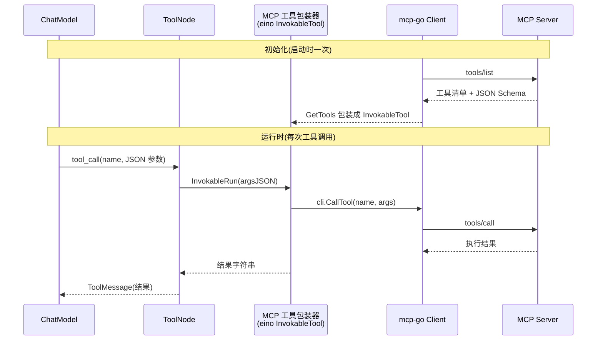

> eino「逐能力核对」系列第 7 篇。第二阶段第三项 **MCP**,结论:**⚠️ eino v0.8.12 的 core 仓库里没有任何 MCP 代码**。三层架构见 [第 1 篇]()。本篇除了澄清「核心没有」这个事实,更想讲一个架构权衡:MCP 用「运行时动态发现工具」换来了解耦,但**代价是把原本一次本地函数调用([第 2 篇]()),变成了一个带超时、重试、部分失败、版本漂移的分布式系统问题**。这个权衡值不值,取决于你的场景。

## 结论:⚠️ 核心没有,别在 core 里找

我把整包 v0.8.12 源码 grep 过,`mcp` 在 core **零命中**。MCP 集成位于独立的 **eino-ext** 仓库,分两个包:

- `components/tool/mcp` —— 把 MCP 工具适配成 eino 的 `InvokableTool`
- `components/prompt/mcp` —— 把 MCP Prompt 适配成 eino 的 `ChatTemplate`

底层封装社区的 `github.com/mark3labs/mcp-go` 客户端。**如果你在 core 仓库找不到 MCP,不是你的错——它本来就不在那儿。** 很多资料含糊地说「eino 支持 MCP」却不告诉你它不在核心,这是本篇要澄清的第一件事。

## 技术背景:编译期固定 vs 运行时动态

回到 [第 2 篇]()。本地 `utils.InferTool` 生成的工具是**编译期固定**的:工具增删改,都要改代码、重编译、重发布 Agent。对一个工具集稳定的 Agent,这没问题。

但设想一个团队级场景:工具由多个团队各自维护、各自迭代,你希望 Agent **运行时连上去、列出当前可用工具、按需调用**,工具那边升级了 Agent 不用动。这就是 MCP(Model Context Protocol,Anthropic 提出)解决的问题——它把工具实现**从 Agent 进程里剥出去**,放进独立的 MCP server,Agent 作为 client 动态发现和调用。

这正是 [第 2 篇]() 结尾提到的「从外部动态发现工具」最想要的形态。但「剥出去」这三个字,就是全部代价的来源。

## 架构设计:适配是 1:1 的,目标是透明

eino-ext 适配层的核心目标是**透明**:从模型视角,MCP 工具与原生 eino 工具不可区分。MCP server 上每个工具 = 一个 eino `InvokableTool`:

```go
import "github.com/cloudwego/eino-ext/components/tool/mcp"

tools, err := mcp.GetTools(ctx, &mcp.Config{
	Cli:          cli,                                    // mark3labs/mcp-go 的 client
	ToolNameList: []string{"read_file", "list_directory"}, // 白名单过滤
})
```

这个「1:1 透明适配」的设计很关键:因为 MCP 工具最终变成了标准 `InvokableTool`,它就能和本地工具**混进同一个 `ToolsConfig`**,ReAct([第 6 篇]())完全无感:

```go
localTool, _ := utils.InferTool("get_weather", "查询天气", getWeather)
allTools := append([]tool.BaseTool{localTool}, mcpTools...)

agent, _ := react.NewAgent(ctx, &react.AgentConfig{
	ToolCallingModel: cm,
	ToolsConfig:      compose.ToolsNodeConfig{Tools: allTools},
	MaxStep:          10,
})
```

从模型和 Agent 的角度,本地工具和远程 MCP 工具长得一模一样。**透明性是这层适配的全部价值**——它让「工具在本地还是在远端」变成一个部署细节,而非编程模型的差异。

## 源码解析:GetTools 内部的三件事

`GetTools` 内部做三件事:

1. **调 `cli.ListTools()` 拉清单**——这是一次**网络往返**,拿到 server 上所有工具的名字和 JSON Schema;
2. **每个 MCP 工具包成 `InvokableTool`**:`Info()` 返回转换后的 `ToolInfo`,`InvokableRun` 内部调 `cli.CallTool`(又一次网络往返);
3. **按 `ToolNameList` 过滤**——白名单收窄工具集。



看这张图的两条虚线分界:**上半段(tools/list)必须只在启动时发生一次,下半段(tools/call)才是运行时的热路径**。把这两段的时机搞错,是 MCP 接入最常见的性能事故。

## 问题挑战 + 性能:解耦把每次调用变成了 RPC

这是本篇的核心权衡。本地工具调用是纳秒级的函数跳转;MCP 工具调用是一次**跨进程或跨网络的 RPC**。一旦工具边界被推过进程,[第 2 篇]() 里「工具即微服务」那句比喻,从「比喻」变成了「字面事实」——分布式系统的所有麻烦全来了:

- **`GetTools` 是初始化操作,绝不能放请求路径**:它内含 `ListTools` 网络调用。启动时做一次、缓存住 `tools`,运行期只走 `CallTool`。每请求 `GetTools` = 每请求多一次网络往返拉清单,纯灾难。
- **`CallTool` 必须设超时**:跨进程/网络,务必用 `ctx` 控超时。一个卡住的 MCP server 会拖垮整轮 Agent——而 Agent 一轮的代价([第 6 篇]())远高于普通调用。超时后是重试还是把错误回喂给模型,要按工具幂等性决定。
- **Schema 版本漂移是新的失败模式**:MCP server 升级了工具 Schema,而你的 Agent 还缓存着旧清单——参数对不上,调用失败。解耦的代价之一就是**契约不再由编译器保证**,你得在运行时面对版本不一致。这是本地工具从不会有的问题。

## 生产实践:管好 client 生命周期

MCP client 持有子进程或长连接,它的生命周期管理是接入 MCP 的核心工程活:

- **启动 `Initialize`,退出 `Close`,全程复用同一个 client**:别每次请求新建——建 client 意味着拉起子进程或建立连接,开销巨大。
- **用白名单收窄工具集**:`ToolNameList` 过滤掉用不到的工具。一个文件系统 server 可能暴露十几个工具,你可能只要两个。少绑工具既降模型选择难度([第 6 篇]() 的循环稳定性),又减小 prompt 体积。
- **stdio 还是 SSE,看部署形态**:`mcp-go` 支持两种传输——**stdio**(client 以子进程拉起 server,标准输入输出通信,适合本地文件/shell 工具)和 **SSE/HTTP**(连远程 server,适合团队共享、跑在别处的工具服务)。选哪种对 eino 适配层无影响,`GetTools` 只认 `Cli` 接口;但它决定了你的故障域——子进程崩了 vs 远程服务不可达,是两套容错逻辑。
- **eino 作 MCP server?** 本篇讲的是 eino 作 **client** 消费外部工具。反向暴露(eino 应用作 server)不在 v0.8.12 这两个适配包范畴,需另用 mcp-go 的 server 端能力。

## MCP Prompt → ChatTemplate

顺带一提,MCP 不只有工具,还能提供 Prompt 模板。`prompt/mcp` 把它适配成 eino 的 `ChatTemplate`([第 1 篇]()):

```go
import "github.com/cloudwego/eino-ext/components/prompt/mcp"

tpl, err := mcp.NewPromptTemplate(ctx, &mcp.Config{
	Cli:  cli,
	Name: "code_review", // MCP server 上某个 prompt 的名字
})
// 之后 tpl 像任何 ChatTemplate 一样放进 Chain / Graph
```

同样是 1:1 透明适配——远程 prompt 用起来和本地模板没区别。

## 小结

MCP 是一个漂亮的解耦方案,eino-ext 的 1:1 透明适配也做得干净——MCP 工具就是 `InvokableTool`,和本地工具无缝混用。但作为架构决策,你要清醒:**它把工具边界推过了进程,原本编译期固定、纳秒级、由类型系统保证契约的本地调用,变成了运行时动态、网络级、契约靠约定的 RPC**。工具集稳定的 Agent 用本地工具更省心;只有当「多团队独立维护工具、运行时动态发现」这个诉求真实存在时,MCP 的解耦才值回它带来的分布式复杂度。

| 项 | 结论 |
|---|---|
| 实现程度 | ⚠️ 核心没有 |
| 位置 | eino-ext:`components/tool/mcp` + `components/prompt/mcp` |
| 核心 API | `mcp.GetTools(ctx, &mcp.Config{Cli, ToolNameList})` |
| 透明性 | MCP 工具 = InvokableTool,对 ReAct 不可区分,可与本地工具混用 |
| 架构代价 | 工具调用变 RPC:GetTools 只在启动、CallTool 必设超时、Schema 会漂移 |

下一篇 **Memory**——第二阶段最需要泼冷水的一项:v0.8.12 根本没有一等的 memory / session 模块。

> **系列导航 · 逐能力核对**
> 第一阶段·掌握:[Prompt]() · [Function Calling]() · [RAG]() · [Embedding]()
> 第二阶段·学习:[compose]() · [ReAct]() · **MCP(本篇)** · [Memory]()
> 第三阶段·企业级:[多智能体]() · [Skill]() · [Runtime]() · [Evaluation]()
