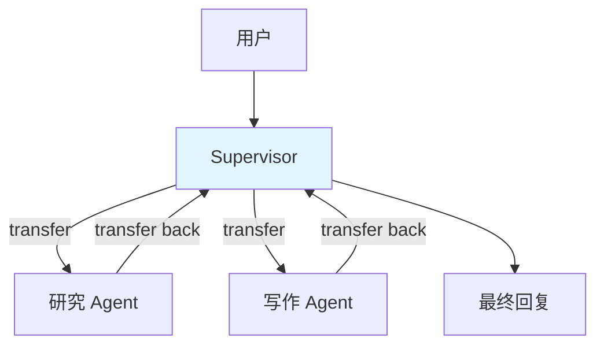
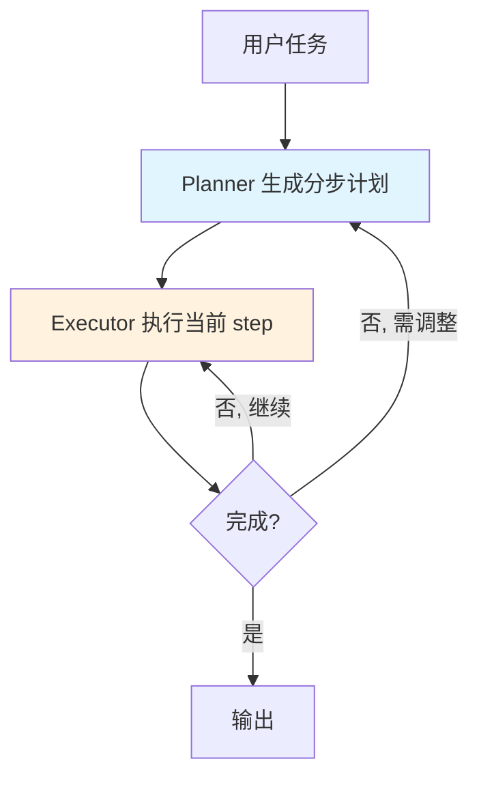

> eino「逐能力核对」系列第 9 篇。第三阶段第一项 **Multi-Agent**,结论:**✅ 一等实现,三种现成范式**。三层架构见 [第 1 篇](),单 Agent 见 [第 6 篇 ReAct]()。本篇除了修正一个流传很广的 API 硬伤,更想立一个判断标尺:**多智能体是「由 LLM 组成的分布式系统」,每增加一个 Agent、每一次控制权交接,都是实打实的模型调用——延迟和成本按跳数翻倍。所以第一原则是克制,不是堆 Agent。**

## 结论:✅ 一等,三范式

源码在 `adk/prebuilt/`(`supervisor` / `planexecute` / `deep`),另有 `flow/agent/multiagent/host`。

## 问题挑战:单 ReAct 的三个天花板

先说清楚「为什么需要多智能体」,否则很容易为了架构而架构。单 ReAct([第 6 篇]())面对复杂任务有三个天花板:

- **上下文膨胀**:所有工具、所有中间结果都堆在一个上下文里,越滚越长(呼应 [第 8 篇]() 的预算问题)。
- **职责混乱**:一个 Agent 绑了几十个工具,选择准确率下降,prompt 稀释。
- **缺乏显式规划**:走一步看一步,没有全局观。

多智能体的思路是**分而治之**。控制权交接统一走 `AgentAction.TransferToAgent` 信号,由 Runner 调度(见 [第 11 篇 Runtime]())。但「分而治之」的红利不是免费的——它用**更多的模型调用**换取**更清晰的职责**,这个交换划不划算,是每次都要算的账。

## 范式一:Supervisor(主管-下属)

一个 Supervisor 统领多个专职子 Agent,负责理解意图、路由任务、汇总结果;子 Agent 干完把控制权 transfer 回 Supervisor。星型拓扑,像项目经理带专家团。



这里是二手教程的一个硬伤,必须修正。真实的 `supervisor.Config` 字段是这样的:

```go
// adk/prebuilt/supervisor/supervisor.go
type Config struct {
	Supervisor adk.Agent   // 主管是一个 Agent,不是 model!
	SubAgents  []adk.Agent
}

func New(ctx context.Context, cfg *Config) (adk.ResumableAgent, error)
```

> ⚠️ 划重点:`supervisor.Config` 的第一个字段是 **`Supervisor adk.Agent`**,不是 `Model`。主管本身是一个已经构造好的 Agent(通常是个 ReAct),而不是一个裸模型。写成 `supervisor.Config{Model: cm, SubAgents: ...}` 是错的。**这个设计其实很有深意**:主管是 Agent 意味着主管自己也能带工具、也能推理,而不只是一个「分类器」——它可以在路由前先自己查点东西再决定派给谁。

正确构造:

```go
import (
	"github.com/cloudwego/eino/adk"
	"github.com/cloudwego/eino/adk/prebuilt/supervisor"
	"github.com/cloudwego/eino/flow/agent/react"
)

// 子 Agent 都是 ReAct(用第 6 篇修正过的公开 API)
researchAgent, _ := react.NewAgent(ctx, &react.AgentConfig{ToolCallingModel: cm, ToolsConfig: researchTools})
writeAgent, _   := react.NewAgent(ctx, &react.AgentConfig{ToolCallingModel: cm})

// 主管本身也是一个 Agent
supAgent, _ := react.NewAgent(ctx, &react.AgentConfig{ToolCallingModel: cm})

sup, err := supervisor.New(ctx, &supervisor.Config{
	Supervisor: supAgent,
	SubAgents:  []adk.Agent{researchAgent, writeAgent},
})
```

Supervisor 的系统 prompt 会带上每个子 Agent 的 `Name` 和 `Description`——这正是子 Agent `Description(ctx)` 方法的用途:让主管知道「什么任务该找谁」。所以**子 Agent 的描述质量直接决定路由准确率**。这是 Description 决定命运的第三次出现([第 2 篇]() 工具、[第 10 篇]() Skill),规律一致:描述含糊 = 频繁路由错误 = 大量无效往返 = 成本和延迟白白翻倍。

## 范式二:Plan-Execute(先规划后执行)

Planner 先生成完整分步计划,Executor 逐步执行,必要时回 Planner 重新规划(replan)。把「规划」和「执行」显式分离,解决 ReAct「走一步看一步、没有全局观」的问题。

```go
import "github.com/cloudwego/eino/adk/prebuilt/planexecute"

pe, err := planexecute.New(ctx, &planexecute.Config{ /* ... */ })
// 返回 adk.ResumableAgent
```

除了 `New`,这个包还单独暴露 `NewPlanner(PlannerConfig)` / `NewExecutor(ExecutorConfig)` / `NewReplanner(ReplannerConfig)`,让你能替换其中某一环。**这个分环暴露是个好的扩展点设计**:你可以只换 Planner(比如用更强的模型专门做规划)而复用 Executor,把成本花在刀刃上。适合步骤明确、需要全局规划的任务(如「调研并写一份报告」)。



## 范式三:Deep(深度智能体)

`deep` 为长程、复杂、需要持久化中间状态的任务设计:整合子 Agent 委派 + 外部文件系统(`adk/filesystem` 的内存后端,见 [第 8 篇]())+ 更强的规划回溯。相当于把 Supervisor 的委派、Plan-Execute 的规划、持久状态揉一起。

```go
import "github.com/cloudwego/eino/adk/prebuilt/deep"

d, err := deep.New(ctx, &deep.Config{ /* ... */ })
// 返回 adk.ResumableAgent
```

机制最重、调用最多、最慢最贵——只有真正长程、要「记笔记」的任务才值得。杀鸡别用牛刀。

## 三者都返回 ResumableAgent

注意 `supervisor.New` / `planexecute.New` / `deep.New` 返回的都是 **`adk.ResumableAgent`**——三种范式**天然支持中断恢复**(human-in-the-loop),细节见 [第 11 篇 Runtime]()。对企业级场景这点很关键:一个跑了十分钟的多智能体任务,中间要人工确认时能中断、确认后能续跑,而不是从头重来——那样的重跑成本高得离谱。

## 性能与成本:每一跳都是模型调用

这是本篇最想钉的判断标尺。多智能体的延迟和成本模型,和单 ReAct 有本质区别:

- **控制权每交接一次,就是至少一次模型调用**。用户 → Supervisor(1 次)→ 研究 Agent(若干次 ReAct 循环)→ transfer back → Supervisor 汇总(1 次)→ ……跳数越多,乘数越大。
- **Supervisor 自己也在烧 token**:它要理解意图、要汇总结果,这些都是模型调用,不是免费的路由。
- **路由错误的代价是双倍**:派错了子 Agent,那个 Agent 白跑一轮,transfer 回来重新派——错误路由把成本直接翻倍。

所以多智能体的性能优化,核心是**减少不必要的跳数和往返**:

- **克制第一**:能用单 ReAct 就别上多 Agent。简单任务用单 ReAct,延迟和成本都更低。这不是保守,是算过账的选择——为一个不需要分工的任务套 Supervisor,你付出的是每请求多几次模型往返,换来的是零收益。
- **给每个子 Agent 收窄工具集**:分而治之的核心红利就是每个 Agent 只带自己需要的工具,prompt 更短、选择更准、循环更稳([第 6 篇]())。别让子 Agent 都绑全量工具,那等于放弃了分治的唯一好处。
- **Description 精准**:如前所述,它直接决定路由准确率,而路由准确率直接决定你烧多少冤枉钱。

## 生产实践:选型三维度

面对一个复杂任务,按三个维度对号入座,别凭感觉选范式:

- 需要**专职分工**(不同子任务要不同专家)→ **Supervisor**
- 需要**全局规划**(步骤多、有依赖、要先谋后动)→ **Plan-Execute**
- 需要**持久记忆与长程**(要记笔记、要回溯、跑很久)→ **Deep**

三者不互斥,但绝大多数场景一种就够。上来就想用 Deep 的,九成是过度设计。

## 小结

多智能体是 eino 企业级能力的门面,三种范式(Supervisor/Plan-Execute/Deep)开箱即用、都支持中断恢复。但它的架构本质是「由 LLM 组成的分布式系统」——分而治之解决了单 Agent 的三个天花板,代价是延迟和成本按控制权跳数翻倍。记住那个被广泛写错的事实:`supervisor.Config` 的主管是 **Agent** 不是 model;也记住那条判断标尺:**先证明单 ReAct 不够,再上多智能体**。

| 项 | 结论 |
|---|---|
| 实现程度 | ✅ 一等,三范式 |
| 源码 | `adk/prebuilt/{supervisor,planexecute,deep}` |
| 关键修正 | `supervisor.Config{Supervisor adk.Agent, SubAgents}`(主管是 Agent) |
| 共性 | 三者 `New` 均返回 `adk.ResumableAgent`,支持中断恢复 |
| 成本主线 | 每次控制权交接 = 模型调用,克制第一 + 收窄工具 + 精准 Description |

下一篇 **Skill 系统**——它真的对标 Anthropic Agent Skills,我逐文件核对过。

> **系列导航 · 逐能力核对**
> 第一阶段·掌握:[Prompt]() · [Function Calling]() · [RAG]() · [Embedding]()
> 第二阶段·学习:[compose]() · [ReAct]() · [MCP]() · [Memory]()
> 第三阶段·企业级:**多智能体(本篇)** · [Skill]() · [Runtime]() · [Evaluation]()
