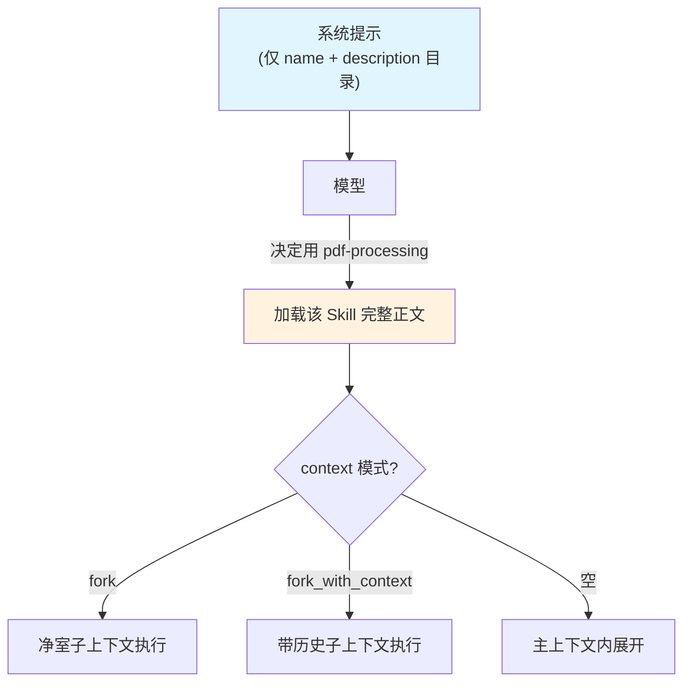

> eino「逐能力核对」系列第 10 篇。第三阶段第二项 **Skill 系统**,结论:**✅ 一等实现,而且真的对标 Anthropic Agent Skills**。这是我最较真核对的一项——很多资料只说「eino 有 skill」,但没人告诉你它和 Anthropic 那套是不是一回事。我逐文件读了 `adk/middlewares/skill/`,结论是:**同一套心智模型**。本篇的贯穿视角:**Skill 本质是「上下文预算」的又一个解法**——它回答的问题是「怎么给一个 Agent 50 项能力,却不用写一个 5 万 token 的系统提示」。三层架构见 [第 1 篇]()。

## 结论:✅ 一等,= Anthropic Agent Skills

源码在 `adk/middlewares/skill/`(`skill.go` + `prompt.go` + `doc.go` + `filesystem_backend.go`)。它不是「像」Anthropic 的 Skill,而是**同一套设计**:

- 每个 Skill 是一个带 **`SKILL.md`** 的目录;
- `SKILL.md` 顶部是 **FrontMatter**(YAML 元数据),下面是正文说明;
- **渐进式披露**(Progressive Disclosure):平时只把 Skill 的名字+描述喂给模型,模型决定用哪个才加载完整正文;
- 触发时可以 **fork** 出子上下文执行,避免污染主对话。

对照过 Anthropic 的 Agent Skills 规范,概念一一对应。

## 问题挑战:上下文预算,又一次

[第 8 篇]() 讲记忆时立过一个观点:上下文窗口是有限且昂贵的预算。Skill 面对的是同一个预算约束的另一面。

设想你的 Agent 要会 20 件事:处理 PDF、分析数据、写 SQL、审代码、画图……每件事的完整操作说明都是上千字。**朴素做法是把这 20 段全塞进系统提示**——结果是一个几万 token 的巨型 prompt,每次请求都全量重发。这有三重灾难:

- **贵**:每请求都为 20 段说明付 prefill 成本,哪怕这次只用到一段;
- **慢**:超长 prompt 拖慢首 token;
- **糊**:20 段说明互相干扰,稀释模型对当前任务的注意力,反而降质。

Skill 的解法是**渐进式披露**:平时只在系统提示里放一份「目录」(每个 Skill 的 name + description,几十 token),模型看目录决定用哪个,**用到哪个才加载哪个的完整正文**。20 段说明各 2000 字,平时只占几百 token 的目录。这是把「静态全量」变成「按需动态」的经典空间换时间——或者说,token 换准确率。

## 架构设计:SKILL.md + FrontMatter + fork

**一个 Skill 就是一个带 `SKILL.md` 的目录**:

```go
// adk/middlewares/skill/skill.go
const skillFileName = "SKILL.md"
```

后端扫描 `BaseDir` 下每个子目录,找里面的 `SKILL.md`。典型布局:

```
skills/
  pdf-processing/
    SKILL.md          # FrontMatter + 正文
    reference.pdf     # 可选的附属资源
  data-analysis/
    SKILL.md
```

`SKILL.md` 的 FrontMatter 结构:

```go
// adk/middlewares/skill/skill.go
type FrontMatter struct {
	Name        string
	Description string
	Context     ContextMode // "" | "fork" | "fork_with_context"
	Agent       string      // 可选:指定用哪个子 Agent 执行
	Model       string      // 可选:指定用哪个模型
}
```

`Name` 和 `Description` 是渐进式披露的关键——它们**总是**出现在主模型的系统提示里(那份目录),正文只在被选中后才加载。所以 **`Description` 写得好不好,直接决定模型会不会在该用的时候想起这个 Skill**——这是「Description 决定命运」在全系列的第四次出现([第 2 篇]() 工具、[第 9 篇]() 子 Agent 路由)。规律已经很清楚了:凡是模型要「从一堆候选里选一个」的地方,选择质量都押在描述上。

## 源码解析:两种 fork 模式,是上下文的空间隔离

```go
// adk/middlewares/skill/skill.go
type ContextMode string

const (
	ContextModeFork            ContextMode = "fork"
	ContextModeForkWithContext ContextMode = "fork_with_context"
)
```

- **`fork`(净室)**:开一个**干净**的子上下文执行 Skill,不带主对话历史。适合独立、自包含的任务(如「处理这个 PDF」),既不需要知道之前聊了什么,又能省 token。
- **`fork_with_context`(带历史)**:fork 子上下文,但**把主对话历史带过去**。适合需要上文才能干活的 Skill。
- **留空**:不 fork,直接在主上下文里展开正文。



> ⚠️ 关键区分:fork 是**空间隔离**——它解决的是「别让 Skill 内部的一堆中间步骤污染主对话」。这和 [第 11 篇 Runtime]() 的中断恢复(**时间中断**)、[第 8 篇]() 的 per-run 状态是三件不同的事,[第 11 篇]() 会用一张表把它们钉死。

## 三处 API 硬伤,逐一修正

核对源码时发现三处流传很广的错误 API,写代码前务必避开。

```go
import (
	"github.com/cloudwego/eino/adk"
	"github.com/cloudwego/eino/adk/middlewares/skill"
	"github.com/cloudwego/eino/adk/filesystem"
)

fsBackend := filesystem.NewInMemoryBackend()
// ... 往 fsBackend 写入 skills/xxx/SKILL.md ...

skBackend, _ := skill.NewBackendFromFilesystem(ctx, &skill.BackendFromFilesystemConfig{
	Backend: fsBackend,
	BaseDir: "skills",
})

mw, _ := skill.NewMiddleware(ctx, &skill.Config{
	Backend: skBackend,
	// CustomSystemPrompt / CustomToolDescription / BuildContent 均可选
})
// mw 是 adk.ChatModelAgentMiddleware,挂到 ChatModelAgent 上
```

> ⚠️ 硬伤一:**用 `skill.NewMiddleware`,返回 `adk.ChatModelAgentMiddleware`(支持 fork)**。老的 `skill.New` 返回 `adk.AgentMiddleware`、**不支持 fork**,已 Deprecated。

> ⚠️ 硬伤二:**v0.8.12 的 `adk/filesystem` 只有 `NewInMemoryBackend()`**,没有 `NewLocalBackend` / `LocalConfig`(见 [第 8 篇]())。`skill.NewBackendFromFilesystem` 接受**任意 `filesystem.Backend` 接口**,所以从**磁盘**读 Skill 得**自己实现一个 `filesystem.Backend`**。资料里直接写 `NewLocalBackend` 的是错的。

> ⚠️ 硬伤三:`skill.Config.UseChinese` 已 Deprecated,改用 `adk.SetLanguage(adk.LanguageChinese)` 统一设置内建 prompt 语言。

## 生产实践

- **Description 是一等公民**:它决定模型会不会在对的时机想起这个 Skill。写清「什么场景该用我」,别写成功能罗列。这是 Skill 系统里投入产出比最高的地方。
- **默认选 `fork`**:除非 Skill 真需要主对话历史,否则用净室 `fork`——上下文更干净、token 更省、行为更可预测。这和 [第 9 篇]() 「给子 Agent 收窄上下文」是同一种洁癖,都是为了让模型每次面对的信息尽量少而准。
- **磁盘读取要自实现 Backend**:别指望 `NewLocalBackend`。生产从磁盘/对象存储加载 Skill,需自己实现 `filesystem.Backend`(Read/List 那几个方法),把 SKILL.md 从你的存储里读出来。
- **别把 Skill 当工具**:Skill 是「一段带元数据、可渐进披露、可 fork 执行的**指令包**」,工具([第 2 篇]())是「一个可调用的**函数**」。Skill 内部可以调工具,但两者不是一层东西——一个装的是「怎么做某类事的说明」,一个装的是「做某件事的能力」。

## 小结

Skill 系统是 eino 里我核对得最仔细、也最惊喜的一项——它是货真价实的 Anthropic Agent Skills,不是蹭概念。而从架构视角,它和记忆是同一枚硬币的两面:都在管理有限的上下文预算,记忆管「历史带多少」,Skill 管「能力露多少」,答案都是「按需、动态、能压缩就压缩」。用对 `NewMiddleware`、认清只有内存后端、把 `Description` 当一等公民,你就用对了它。

| 项 | 结论 |
|---|---|
| 实现程度 | ✅ 一等,= Anthropic Agent Skills |
| 源码 | `adk/middlewares/skill/`(skill/prompt/doc/filesystem_backend) |
| 核心机制 | SKILL.md + FrontMatter + 渐进式披露 + fork/fork_with_context |
| 关键 API | `skill.NewMiddleware`(返回 `ChatModelAgentMiddleware`,支持 fork) |
| 三处修正 | 用 `NewMiddleware` 非 `New`;磁盘需自实现 `filesystem.Backend`;`UseChinese`→`adk.SetLanguage` |
| 架构主线 | 渐进式披露 = 上下文预算的按需解法,与 [第 8 篇]() 记忆同源 |

下一篇 **Agent Runtime**——把前面所有 Agent 跑起来的那层:Runner 调度、事件流、中断恢复 checkpoint。

> **系列导航 · 逐能力核对**
> 第一阶段·掌握:[Prompt]() · [Function Calling]() · [RAG]() · [Embedding]()
> 第二阶段·学习:[compose]() · [ReAct]() · [MCP]() · [Memory]()
> 第三阶段·企业级:[多智能体]() · **Skill(本篇)** · [Runtime]() · [Evaluation]()
