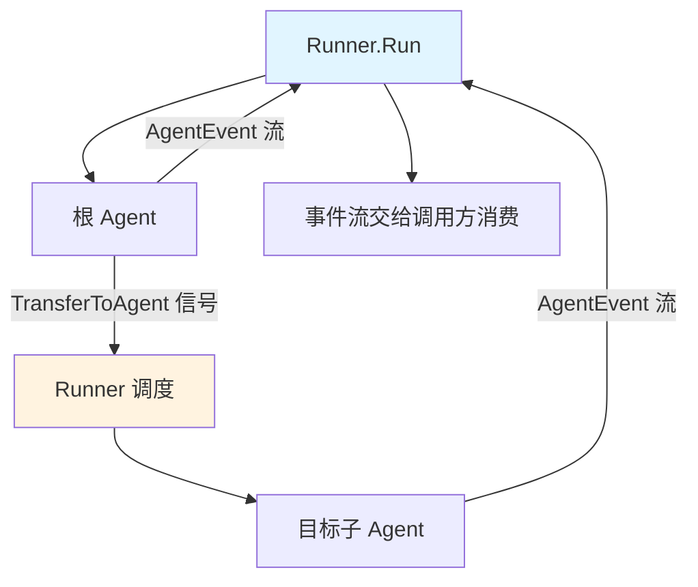

> eino「逐能力核对」系列第 11 篇。第三阶段第三项 **Agent Runtime**,结论:**✅ 一等实现,但别被 v0.9 的品牌名带偏**。前面几篇造出来的 Agent(单 ReAct、多智能体、Skill)靠什么跑起来、怎么中断怎么恢复——都在这层。本篇的核心论点:**Runtime 里的中断恢复(checkpoint),是把一个「Agent demo」变成「能上生产的系统」的那道分水岭**——因为生产系统里,总有一个动作危险到必须让人类先点头。三层架构见 [第 1 篇]()。

## 结论:✅ 一等,但 v0.8.12 没有「agentic-runtime」这个牌子

源码在 `adk/`:`runner.go` / `runctx.go` / `interrupt.go` / `react.go` / `workflow.go` / `deterministic_transfer.go`。

> ⚠️ 划重点:有些资料把这层叫「agentic runtime」,还提 `turn_loop.go` / `cancel.go` 之类的文件。**v0.8.12 里没有这些**——那是 **v0.9** 的东西。v0.8.12 的运行时就是上面这几个文件,老老实实叫 **Runner + 事件流 + 中断恢复**。别拿 v0.9 的品牌套 v0.8.12 的源码,选型评估要按你实际用的版本的真实文件来。

## 架构设计:Runner 是调度器

前面几篇反复出现的 `agent.Run(ctx, &adk.AgentInput{...})`,背后由 **Runner** 驱动。Runner 干三件事:

1. 启动根 Agent 的一次运行;
2. 消费 Agent 产生的**事件流**(`AgentEvent`);
3. 处理控制权交接——当某个 Agent 发出 `AgentAction.TransferToAgent`([第 9 篇]() 多智能体就靠它),Runner 负责把控制权转给目标 Agent。

`deterministic_transfer.go` 保证这种转移是**确定性**的:谁转给谁、按什么顺序,有明确规则,而不是靠模型即兴。这点在生产上很重要——一个可复现的调度顺序,才可能被测试、被排查;如果控制权交接本身是随机的,你的多智能体系统就是不可调试的。



## 核心实现:AgentEvent 事件流

Agent 运行不是「调一次返回一个结果」,而是**吐一条事件流**。调用方 `for` 循环消费:

```go
iter := agent.Run(ctx, &adk.AgentInput{Messages: msgs})
for {
	event, ok := iter.Next()
	if !ok {
		break
	}
	// event 里有:哪个 Agent、产生了什么(消息/工具调用/transfer/中断)、RunPath 等
}
```

`AgentEvent` 携带的 `RunPath`(运行路径)在多智能体场景特别有用——它记录这次请求实际经过了 Supervisor→研究 Agent→写作 Agent 这样的链路,是**可观测性的天然抓手**([第 12 篇 Evaluation]() 会把它用作过程评估的数据源)。把每次运行的 RunPath 落库,你就能回答「哪条链路慢、哪个子 Agent 常出错」——没有它,多智能体就是个黑盒。

> ⚠️ 性能提示:事件流是迭代器,**必须消费到底**。不 `for` 到 `!ok` 可能导致上游 goroutine 阻塞、资源不释放——和 [第 5 篇]() 「StreamReader 不读完必须 Close」是同一类问题的不同表现。流式的东西,要么读完,要么显式关掉。

## 问题挑战:生产系统需要一个「人类确认」的闸门

这是本篇的核心。一个 Agent demo 和一个能上生产的 Agent 系统,最大的区别之一是:**生产系统里总有一些动作,危险到不能让模型自己拍板**——删生产库、发起大额支付、给全体用户群发。对这些动作,你需要一个**人类确认闸门**:Agent 跑到这一步先停下,等人点头,再继续。

难点在于「停下再继续」不是简单的暂停。Agent 可能已经跑了十分钟、经过了多个子 Agent、积累了一堆中间状态。你不能:

- **从头重跑**——那十分钟的模型调用成本和延迟全白费,而且模型有随机性,重跑未必走到同一步;
- **在内存里干等**——一个 HTTP 请求 hold 十分钟等人工,连接早断了,进程重启状态就没了。

正确的解法是把「未完成的运行」**序列化成 checkpoint 存起来**,人工确认后再从 checkpoint **恢复**。

## 核心实现:ResumableAgent + checkpoint

[第 9 篇]() 提过三种多智能体范式的 `New` 都返回 `adk.ResumableAgent`。中断恢复就是这层的核心能力,实现在 `interrupt.go`:

```go
// Agent 跑到危险动作前中断,拿到中断信息;人工确认后 Resume
resumable, ok := agent.(adk.ResumableAgent)
if ok {
	iter := resumable.Resume(ctx, &adk.ResumeInfo{ /* 断点信息 + 人工输入 */ })
	// 继续消费事件流,从断点续跑
}
```

流程是:Agent 跑到「即将删除生产库」时**中断**,把当前状态存成 **checkpoint**;这次请求就此返回(可能给用户弹一个「确认删除?」);人工点确认后,另一个请求带着确认信息 `Resume`,从断点继续,不用从头重跑。这就把「Agent 自主执行」和「人类监督」缝在了一起——**这才是企业敢把 Agent 接到真实系统上的前提**。

## 源码解析:三个「隔离/持久化」概念,一张表钉死

全系列出现了三个听起来像、实则完全不同的概念,极易混淆。我把它们放一起对照——理解这张表,你就理解了 eino 状态管理的全貌:

| 概念 | 出处 | 解决什么 | 生命周期 | 语义 |
|---|---|---|---|---|
| **per-run 状态** | [第 8 篇]() `adk/runctx` | 单次 Run 内多轮循环记住已发生的 | 一次 Run | 运行时 |
| **fork 子上下文** | [第 10 篇]() skill | 别让 Skill 中间步骤污染主对话(空间隔离) | Skill 执行期间 | 上下文 |
| **checkpoint** | 本篇 `interrupt.go` | 存未完成的 Run 以便人工确认后 Resume(时间中断) | 跨中断,直到 Resume | 运行时 |
| **跨会话记忆** | [第 8 篇]() 应用层 | 记住用户历史聊过什么 | 跨会话,持久 | 业务 |

最常被混淆的是 **checkpoint** 和 **跨会话记忆**:一个存「一次运行卡在哪、怎么续」(运行时语义),一个存「用户聊过什么」(业务语义)。用 checkpoint 当聊天记录、或用聊天记录当 checkpoint,都会踩坑。两套存储、两种语义,别合并。

## 生产实践

- **checkpoint 的存储自己定**:框架给你中断/恢复的机制,但 checkpoint 落哪(内存/Redis/DB)是应用层的事。生产里几乎一定是 Redis 或 DB——因为要跨进程、跨请求、扛重启。内存 checkpoint 只够 demo。
- **中断恢复要求 Agent 是 ResumableAgent**:普通 Agent 不一定支持 Resume。多智能体三范式([第 9 篇]())天然是 ResumableAgent,可直接用。
- **RunPath 落库做可观测**:把事件流里的 RunPath、每步耗时采集下来,是你排查多智能体问题、给 [第 12 篇]() 提供过程评估数据的基础。
- **别按 v0.9 的文件名找代码**:v0.8.12 没有 `turn_loop.go`/`cancel.go`。按 `runner.go`/`runctx.go`/`interrupt.go` 来。

## 小结

Agent Runtime 是把前面所有能力「跑起来」的那层:Runner 确定性调度 + AgentEvent 事件流 + checkpoint 中断恢复。其中中断恢复是最有生产分量的一环——它提供了「人类确认闸门」,让 Agent 能安全地接触真实世界里那些不可逆的危险动作。这道闸门,加上把 checkpoint、per-run 状态、fork、跨会话记忆四个概念分清,是你把 Agent 从 demo 推上生产的关键。别忘了那个版本澄清:v0.8.12 没有「agentic-runtime」品牌,别按 v0.9 的地图找路。

| 项 | 结论 |
|---|---|
| 实现程度 | ✅ 一等 |
| 源码 | `adk/runner.go`/`runctx.go`/`interrupt.go`/`react.go`/`workflow.go`/`deterministic_transfer.go` |
| 核心机制 | Runner 调度 + TransferToAgent + AgentEvent 事件流 + checkpoint 中断恢复 |
| 生产分水岭 | 中断恢复 = 人类确认闸门,危险动作前停下等人点头 |
| 关键澄清 | v0.8.12 无「agentic-runtime」品牌、无 turn_loop/cancel(那是 v0.9) |

下一篇 **Agent Evaluation**——系列收官,也是唯一一个「❌ v0.8.12 根本没有」的能力,讲清缺口和自建方案。

> **系列导航 · 逐能力核对**
> 第一阶段·掌握:[Prompt]() · [Function Calling]() · [RAG]() · [Embedding]()
> 第二阶段·学习:[compose]() · [ReAct]() · [MCP]() · [Memory]()
> 第三阶段·企业级:[多智能体]() · [Skill]() · **Runtime(本篇)** · [Evaluation]()
